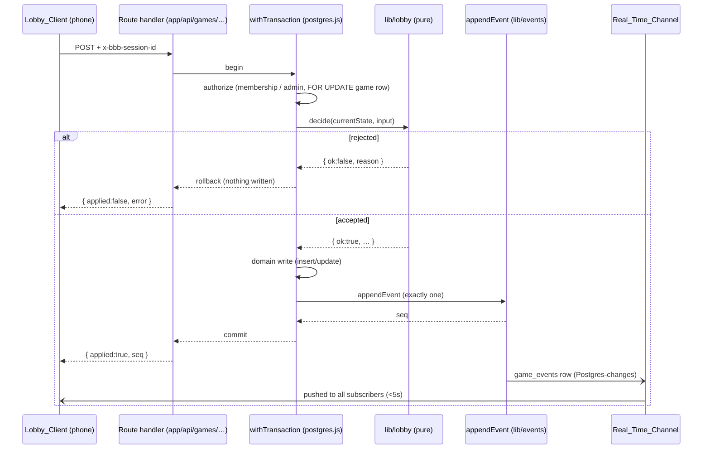

# Design Document

## Overview

**Game Setup & Lobby** (ROADMAP F1.1–F1.3) is the first player-facing feature built on the
web-app-foundation backbone. It implements one lobby lifecycle: an Admin creates a Game and
designates start/finish bars, Players join via a Join_Code and form 2–4 Teams, and the Admin
starts the Game (`lobby → live`).

This design's central principle is **reuse, not reinvention**. The foundation already provides
every mechanism this feature needs:

- **Atomic domain-write + one event** — `withTransaction` (`lib/db/server.ts`) + `appendEvent`
  (`lib/events`). This is the exact shape R6 demands.
- **Gap-free per-game sequence** — `appendEvent` takes a `FOR UPDATE` lock on the game row and
  assigns `max(seq)+1`, which is precisely the serialization R6.6 requires.
- **Session-based identity + RLS** — `games.admin_session_id`, `players.session_id` (unique per
  `game_id`), and `bbb_is_game_member` (migration 0006). This is R8's model.
- **Pure lobby rules** — `validateBarDesignation` (`lib/games`, R2.3), `canStartGame` (2–4 team
  bound, `lib/gameend`, R5.1/5.3/5.4). Already written, already property-tested.
- **Realtime subscribe/snapshot/reconnect/resume** — `lib/realtime/*`. This is R7 wholesale.
- **Durable client watermark with graceful fallback** — `LocalStorageLastSeenStore`
  (`lib/realtime/lastSeenStore.ts`). This is the model for R8's session-persistence criteria
  (R8.6–R8.9).

The new code is therefore thin: a set of **pure lobby-domain functions** in `lib/lobby/` (the
validation and decision logic for create/designate/join/team/start), a small set of **server
route handlers** under `app/api/games/` that wrap those functions in `withTransaction` +
`appendEvent` + a membership/admin check (mirroring `demo-mutation` and the `end` route), one
new **client-side session store** (`lib/session/`, mirroring `lastSeenStore.ts`), and the
**mobile-first Lobby_Client** components/page.

### Scope boundaries (from requirements)

- **Bars are referenced, not discovered.** F2.1 owns bar discovery (map/list/propose). Here,
  `bars` rows already exist (or are inserted by the Admin by name/location) and start/finish
  are designated by id. No map, no geocoding.
- **No claiming/scoring/cards.** The `live` transition only *unlocks* claiming; this feature
  does not implement it.
- **Admin-loss recovery is deferred to F4.2.** A live Game with an unreachable Admin still
  ends via the foundation's auto-timeout sweep (migration 0007). We do not add transfer here.

## Architecture

### Layering

The feature follows the established three-layer split from the structure steering:

```
components/  Lobby_Client UI (React, mobile-first)  — R9
  ↕ (subscribe + POST)
app/api/games/…  server route handlers             — thin transactional wrappers
  ↕ (withTransaction + appendEvent)
lib/lobby/   pure lobby-domain logic                — validation + decisions (framework-free)
lib/session/ durable client session store          — R8.6–R8.9 (mirrors lastSeenStore)
  ── reuses ──
lib/db/server (withTransaction), lib/events (appendEvent),
lib/games (validateBarDesignation), lib/gameend (canStartGame),
lib/realtime (subscribe/snapshot/reconnect/resume, LastSeenStore)
```

The pure `lib/lobby/` logic performs **no I/O** and is the property-test target. The route
handlers own the transaction boundary, the session/admin authorization check, and translating
domain results into HTTP responses — exactly as `demo-mutation/route.ts` and
`games/[gameId]/end/route.ts` already do.

### Request flow (write path)

Every lobby mutation is one server route that:

1. Reads the `x-bbb-session-id` header (session-based identity, R8.3).
2. Opens `withTransaction` (single transaction, R6.1).
3. Runs an in-transaction authorization query (membership for player actions, admin for
   admin actions) — mirroring `MEMBERSHIP_SQL`/`ADMIN_CHECK_SQL` (R8.4/R8.5).
4. Calls the pure `lib/lobby` decision function against the current locked state; on
   rejection returns a structured `{ applied: false, error }` and writes nothing (R6.5).
5. On acceptance, performs the domain write **and** `appendEvent` (exactly one) in the same
   transaction (R6.1), returning the new `seq` (R6.4).
6. Any throw rolls the transaction back — no partial domain change, no event (R6.2/R6.3).



### Read / propagation flow

The Lobby_Client uses `lib/realtime` unchanged:

- On mount: `subscribe(gameId, { transport, snapshotSource, lastSeenStore })` loads a snapshot
  (fold of all `game_events` with `seq <= N`, R7.2) and opens a per-game channel (R7.1, R7.4).
- Live events flow through `applyInOrder` (ordered, de-duplicated, R7.3).
- Connection loss uses `ReconnectController` (≤5s, ≤12 attempts, then terminal, R7.5).
- Resume/relaunch uses `ResumeController` + `resumeReinitialize` (catch-up from persisted
  watermark, R7.6).

The lobby's contribution is a **lobby reducer** that folds the lobby event types into a
`LobbyView` the UI renders. It extends the existing snapshot fold seam rather than replacing it.

## Components and Interfaces

### 1. `lib/lobby/` — pure lobby-domain logic (new, framework-free)

This is the heart of the new code and the property-test target. Each function is a pure
decision/validation over inputs, returning a structured result. No database access.

#### 1a. Join_Code generation and validation (`lib/lobby/joinCode.ts`)

```ts
/** Alphabet for generated codes: unambiguous alphanumerics. */
export const JOIN_CODE_ALPHABET: string;          // e.g. no 0/O/1/I
export const GENERATED_CODE_LENGTH = 8;           // within R1.4's 6–8
export const MAX_CODE_GEN_ATTEMPTS = 5;           // R1.5

/** Generate one candidate code (injectable RNG for tests). */
export function generateJoinCode(rand?: () => number): string;

/** R1.4: a generated code is 6–8 alphanumeric chars. */
export function isValidGeneratedCode(code: string): boolean;

/** R3.1/R3.3: a *submitted* join code is 6–12 alphanumeric chars (looser than generated). */
export function isValidSubmittedCode(code: string): boolean;
export function normalizeSubmittedCode(code: string): string; // trim + upcase
```

Note the asymmetry the requirements mandate: the service **generates** 6–8 chars (R1.4) but
**accepts** 6–12 chars on submit (R3.1/R3.3), so a valid generated code is always an
acceptable submission, and format validation rejects out-of-range submissions before any DB
lookup.

The uniqueness constraint (R1.4: unique across non-`ended` games) and the 5-attempt retry
(R1.5) live in the create route, which retries generation against the DB unique index; the
pure layer only decides code *shape* and produces candidates.

#### 1b. Display-name validation (`lib/lobby/displayName.ts`)

```ts
export const MIN_DISPLAY_NAME = 1;
export const MAX_DISPLAY_NAME = 40;

export type DisplayNameResult =
  | { ok: true; value: string }          // trimmed, 1–40 chars
  | { ok: false; reason: "invalid_display_name" };

/** R3.5/R3.6: trim leading/trailing whitespace, then require 1–40 chars. */
export function validateDisplayName(raw: string): DisplayNameResult;
```

#### 1c. Team validation (`lib/lobby/team.ts`)

```ts
export const MAX_TEAM_NAME = 100;

/** The palette of distinct team colors, in assignment order. Length >= 4 (MAX_TEAMS). */
export const TEAM_COLORS: readonly string[];

export type TeamNameResult =
  | { ok: true; value: string }
  | { ok: false; reason: "invalid_team_name" };

/** R4.4/R4.7: non-empty, <= 100 chars (trimmed). */
export function validateTeamName(raw: string): TeamNameResult;

export type CreateTeamResult =
  | { ok: true; color: string }                       // color distinct from existing
  | { ok: false; reason: "team_limit_reached" }       // R4.3
  | { ok: false; reason: "invalid_team_name" };        // R4.7

/**
 * R4.2/R4.3/R4.4: given the colors already used in the game and the count of teams,
 * decide whether a new team may be created and, if so, pick a color distinct from
 * all existing team colors.
 */
export function decideCreateTeam(
  existingColors: readonly string[],
  proposedName: string,
): CreateTeamResult;
```

`decideCreateTeam` reuses `MAX_TEAMS` from `lib/gameend`. Color assignment picks the first
palette color not present in `existingColors`; the palette is sized `>= MAX_TEAMS` so a color
is always available when `existingColors.length < MAX_TEAMS` (R4.4).

#### 1d. Bar designation (reuse `lib/games`)

Start/finish designation reuses `validateBarDesignation` from `lib/games` verbatim (R2.3:
start ≠ finish, mirroring the `games_start_finish_differ` CHECK). The route adds the
existence check (R2.4), the lobby-phase guard (R2.6), and the admin guard (R2.8).

#### 1e. Start eligibility (reuse `lib/gameend`)

The start route reuses `canStartGame(teamCount)` from `lib/gameend` (R5.1/R5.3/R5.4: 2–4
teams). The route additionally checks both bars are designated (R5.5), the lifecycle is
`lobby` (R5.7), and the requester is the admin (R5.6).

### 2. `lib/lobby/events.ts` — lobby event types + reducer (new)

Defines the lobby `event_type` string constants and a pure fold that turns a game's event log
into a `LobbyView`. It plugs into the existing snapshot fold: the realtime `applyEvent`
(`lib/realtime/snapshot.ts`) advances `lastSeenSequence`; the lobby reducer interprets the
payloads.

```ts
export const LOBBY_EVENT_TYPES = {
  gameCreated: "game_created",
  barsDesignated: "bars_designated",
  playerJoined: "player_joined",
  teamCreated: "team_created",
  teamChanged: "team_changed",
  gameStarted: "game_started",
} as const;

export interface LobbyTeamView { id: string; name: string; color: string; playerIds: string[]; }
export interface LobbyPlayerView { id: string; displayName: string; teamId: string | null; }
export interface LobbyView {
  gameId: string;
  lifecycle: "lobby" | "live" | "ended";
  joinCode: string | null;
  startBarId: string | null;
  finishBarId: string | null;
  teams: LobbyTeamView[];
  players: LobbyPlayerView[];
  lastSeenSequence: number;
}

export function initialLobbyView(gameId: string): LobbyView;
export function applyLobbyEvent(view: LobbyView, event: GameEvent): LobbyView; // pure, seq-ordered
export function foldLobbyEvents(gameId: string, events: readonly GameEvent[]): LobbyView;
```

`applyLobbyEvent` is idempotent against `seq <= lastSeenSequence` (same guard as
`lib/realtime/snapshot.applyEvent`), so re-delivery from the transport never double-applies
(R7.3). This is the payload interpreter the UI subscribes through.

### 3. Server routes (new, under `app/api/games/`)

Each is a `runtime = "nodejs"` handler that wraps `withTransaction`, mirroring the existing
`demo-mutation` and `end` routes. All authorization checks run **inside the transaction**
against a `FOR UPDATE`-locked game row where the decision depends on current state.

| Route | Method | Purpose | Auth | Reqs |
|---|---|---|---|---|
| `app/api/games/route.ts` | POST | Create game + generate Join_Code | valid session (becomes admin) | R1, R8.1 |
| `app/api/games/[gameId]/bars/route.ts` | POST | Designate start/finish bars | admin | R2 |
| `app/api/games/[gameId]/join/route.ts` | POST | Join game (display name) | valid session | R3, R8.2 |
| `app/api/games/[gameId]/teams/route.ts` | POST | Create team | game member | R4.2–R4.4, R4.7 |
| `app/api/games/[gameId]/teams/select/route.ts` | POST | Join/switch team | game member | R4.1, R4.5 |
| `app/api/games/[gameId]/start/route.ts` | POST | Start game (`lobby→live`) | admin | R5 |

Shared helpers factored into `app/api/games/_shared.ts` (or reused from a small `lib/lobby`
auth helper): `requireSession(request)`, `assertMember(tx, gameId, sessionId)`,
`assertAdmin(tx, gameId, sessionId)` — the SQL is lifted directly from the existing routes'
`MEMBERSHIP_SQL` / `ADMIN_CHECK_SQL`.

Each route returns the established shape: `{ applied: true, seq, … }` on success (R6.4) or
`{ applied: false, error }` with an appropriate status on rejection (R6.5), matching
`demo-mutation`.

#### Create route: Join_Code uniqueness + retry (R1.4/R1.5)

The unique constraint already exists (`games.join_code text not null unique`). The route:
generates a candidate (`generateJoinCode`), attempts the insert; on unique-violation, retries
up to `MAX_CODE_GEN_ATTEMPTS` (5) times; if all attempts collide, rolls back and returns a
structured failure with no game and no event (R1.5). "Unique across non-`ended` games" (R1.4)
is enforced by generating from a large space plus the DB unique index; because ended games
retain their codes, a collision is possibly with any game, and the retry handles it.

### 4. `lib/session/` — durable client session store (new; mirrors `lastSeenStore.ts`)

R8.6–R8.9 require the Lobby_Client to persist the Session identifier in durable storage that
survives close/reopen on the same device+browser, present it on later requests, and
gracefully establish a new session when absent/unreadable. This mirrors
`LocalStorageLastSeenStore` almost exactly — same `StorageLike` seam, same probe-and-fallback,
same never-throw discipline.

```ts
export interface StorageLike { getItem; setItem; removeItem; }   // same shape as lastSeenStore

export class SessionStore {
  constructor(storage?: StorageLike);          // defaults to a usable localStorage, else in-memory
  /** R8.7/R8.9: the persisted session id, or null when absent/unreadable. */
  get(): string | null;
  /** R8.6: persist the session id durably (best-effort; never throws). */
  set(sessionId: string): void;
  /** R8.6–R8.9: return the persisted id, or generate+persist a new one when absent. */
  getOrCreate(generate?: () => string): string;
}

/** Default id generator: crypto.randomUUID() with a fallback. */
export function newSessionId(): string;
```

`getOrCreate` is the entry point the client calls on load: if `get()` returns a value it is
reused (R8.7), else a new id is generated and persisted (R8.9). When storage is unusable the
store degrades to in-memory (a new session per launch), exactly as `lastSeenStore` degrades
its watermark — the app keeps working, persistence just weakens. The generated/persisted id is
sent as `x-bbb-session-id` on every request; when it equals a game's `admin_session_id`, the
server re-recognizes the admin (R8.8) with no extra client state.

### 5. Lobby_Client (new, `components/` + `app/` page) — R9

A mobile-first React surface, matching the existing viewport-test convention
(`app/page.viewport.test.tsx`). Composed of:

- `components/lobby/CreateGame.tsx` — admin create form + bar designation.
- `components/lobby/JoinGame.tsx` — code entry + display-name form.
- `components/lobby/TeamSelection.tsx` — team list, create-team, join/switch.
- `components/lobby/LobbyRoster.tsx` — Join_Code display, teams w/ colors, players (R9.3/R9.4).
- `components/lobby/StartGame.tsx` — admin start button (enabled only when eligible).
- `app/games/[gameId]/lobby/page.tsx` — wires the above, owns the `subscribe(...)` lifecycle,
  the `SessionStore`, and the `LobbyView` state updated by `applyLobbyEvent` (R9.5).

Mobile-first constraints (R9.1/R9.2): single-column layout at 360–430px with no horizontal
overflow, and ≥44×44px touch targets, enforced via CSS (globals.css / component styles) and
verified by a viewport test.

## Data Models

**No schema changes are required.** The foundation schema (migration 0001) already models
everything this feature persists:

| Concept | Table / column (existing) | Notes |
|---|---|---|
| Game + lifecycle | `games.lifecycle` (`lobby`/`live`/`ended`) | R1.1 sets `lobby`; R5.1 sets `live` |
| Admin identity | `games.admin_session_id text not null` | R1.2, R8.1 |
| Join code | `games.join_code text not null unique` | R1.4 uniqueness via index |
| Live timestamp | `games.live_started_at timestamptz` | R5.2 (`games_live_started_at_when_started` CHECK) |
| Start/finish bars | `games.start_bar_id`, `games.finish_bar_id` | R2; `games_start_finish_differ` CHECK = R2.3 |
| Bars | `bars (id, game_id, name, location)` | referenced by id; discovery deferred (F2.1) |
| Teams | `teams (id, game_id, name, color)` | R4; color distinctness enforced by app logic |
| Players | `players (id, team_id, game_id, session_id, display_name)` | R3/R4 |
| One player per session/game | `players_game_session_unique (game_id, session_id)` | R3.8, R8.2 |
| Player's team in same game | `players_team_fk (team_id, game_id) → teams` | R4.1/R4.5 integrity |
| Event log | `game_events` (migration 0003) | R6, R7 propagation source |

### Lobby event payloads

Lobby mutations append one `game_event` each; payloads are small JSON objects (well under the
16 KB bound `appendEvent` enforces). The `actor` is `admin` for admin actions, the joining/
acting team id where a team is the actor, or `admin`/`system` per the existing `EventActor`
model.

| `event_type` | actor | payload | Written by |
|---|---|---|---|
| `game_created` | `admin` | `{ joinCode }` | create route (R1.6) |
| `bars_designated` | `admin` | `{ startBarId, finishBarId }` | bars route (R2.7) |
| `player_joined` | `admin` (or team once assigned) | `{ playerId, displayName }` | join route (R4.6) |
| `team_created` | `admin` | `{ teamId, name, color }` | teams route (R4.6) |
| `team_changed` | team | `{ playerId, fromTeamId, toTeamId }` | teams/select route (R4.6) |
| `game_started` | `admin` | `{ liveStartedAt }` | start route (R5.8) |

### Notable state transitions

- Player identity is the `(game_id, session_id)` pair; a repeat join for the same pair returns
  the existing player (R3.8) rather than inserting — the route reads the unique row first.
- Team switch (R4.5) is a single `UPDATE players SET team_id = $new` — the composite FK keeps
  the new team in the same game; the previous association is replaced atomically with its one
  `team_changed` event.

## Correctness Properties

*A property is a characteristic or behavior that should hold true across all valid executions
of a system — essentially, a formal statement about what the system should do. Properties serve
as the bridge between human-readable specifications and machine-verifiable correctness
guarantees.*

The properties below target the **pure `lib/lobby/` and `lib/session/` logic** and the lobby's
extension of the event fold. Where the foundation already provides a property-tested mechanism
(atomic write, gap-free seq, ordered apply, reconnect schedule, resume catch-up, bar-differ
rule), the property is stated once and noted as reusing that existing suite rather than being
re-implemented. Requirements covered only by fixed-shape outcomes or external Supabase behavior
(1.1, 1.3, 1.5–1.8, 2.1–2.2, 2.4–2.5, 2.7, 3.1–3.2, 4.1, 4.6, 5.2, 5.8, 6.4–6.5, 7.1, 9.x) are
handled by unit/integration/viewport tests in the Testing Strategy, not by properties.

### Property 1: Admin session is recorded verbatim on create

*For any* session identifier, creating a Game records that exact session identifier as the
Game's `admin_session_id` (a create-with-`sid` round-trips to `admin_session_id === sid`).

**Validates: Requirements 1.2, 8.1**

### Property 2: Generated Join_Codes have valid, acceptable shape

*For any* random-number stream, `generateJoinCode` produces a string of 6 to 8 characters all
drawn from `JOIN_CODE_ALPHABET`, and that string is accepted by both `isValidGeneratedCode`
(6–8 alphanumeric) and `isValidSubmittedCode` (6–12 alphanumeric).

**Validates: Requirements 1.4**

### Property 3: Submitted Join_Code format acceptance

*For any* string, the submitted-code validator accepts it if and only if, after normalization
(trim + upcase), its length is between 6 and 12 inclusive and every character is alphanumeric;
any other string (empty, too short, too long, containing non-alphanumerics) is rejected.

**Validates: Requirements 3.3**

### Property 4: Display-name validation and trimming

*For any* raw string, `validateDisplayName` accepts it if and only if the string with leading
and trailing whitespace removed has length between 1 and 40 inclusive; on acceptance it returns
exactly that trimmed value, and on rejection (including all-whitespace and over-40 inputs) it
returns an `invalid_display_name` result.

**Validates: Requirements 3.5, 3.6**

### Property 5: Team-name validation and trimming

*For any* raw string, `validateTeamName` accepts it if and only if the trimmed string has length
between 1 and 100 inclusive; empty, all-whitespace, and over-100 inputs are rejected with an
`invalid_team_name` result.

**Validates: Requirements 4.4, 4.7**

### Property 6: Create-team count gate

*For any* current team count, `decideCreateTeam` permits creating a new Team if and only if the
count is fewer than `MAX_TEAMS` (4); at 4 or more it returns `team_limit_reached`.

**Validates: Requirements 4.2, 4.3**

### Property 7: Assigned team color is distinct from existing teams

*For any* set of existing Team colors drawn from `TEAM_COLORS` whose size is fewer than
`MAX_TEAMS`, `decideCreateTeam` (given a valid name) assigns a color that is not present in that
existing-color set.

**Validates: Requirements 4.4**

### Property 8: Start-game team-count bound

*For any* team count, `canStartGame` returns true if and only if the count is between 2 and 4
inclusive; the start transition is permitted only when it does. (Reuses the existing
`lib/gameend` property suite.)

**Validates: Requirements 5.1, 5.3, 5.4**

### Property 9: Start requires both bars designated

*For any* combination of start-bar and finish-bar presence (each designated or not), the start
bar-designation gate passes if and only if both the start bar and the finish bar are designated.

**Validates: Requirements 5.5**

### Property 10: Bar designation start ≠ finish

*For any* pair of start/finish bar ids, `validateBarDesignation` rejects the designation if and
only if both are non-null and equal; otherwise (either side undesignated, or both set and
different) it accepts. (Reuses the existing `lib/games` property suite.)

**Validates: Requirements 2.3**

### Property 11: Lobby-phase gate

*For any* Game lifecycle value, a lobby mutation (designate bars, join, create/switch team,
start) is permitted if and only if the lifecycle is `lobby`; for `live` or `ended` it is
rejected and the targeted state is left unchanged.

**Validates: Requirements 2.6, 3.4, 4.8, 5.7**

### Property 12: Admin-authorization gate

*For any* pair of an admin session identifier and a requesting session identifier, an admin-only
action (designate bars, start game, and admin capabilities generally) is permitted if and only
if the requesting session equals the Game's `admin_session_id`; otherwise it is rejected and the
targeted state is unchanged.

**Validates: Requirements 2.8, 5.6, 8.1, 8.8**

### Property 13: Membership-authorization gate

*For any* Game membership set (its admin session and its players' sessions) and any requesting
session, a request to modify that Game's lobby state is permitted if and only if the requesting
session is a member (the admin or a joined player); a non-member request is rejected and leaves
the state unchanged.

**Validates: Requirements 8.4, 8.5**

### Property 14: One player per session per game (join idempotence)

*For any* Game and session identifier, applying any number of join requests for that
`(game, session)` pair yields exactly one Player record — the first — and the stored player
count for that pair never exceeds one; a repeat join returns the existing Player.

**Validates: Requirements 3.8, 8.2**

### Property 15: Join records the joining session and trimmed name

*For any* session identifier and any valid raw display name, the recorded Player carries that
session identifier and the trimmed display name (a join round-trips its session and normalized
name).

**Validates: Requirements 3.7**

### Property 16: Team switch yields exactly one team association

*For any* Player currently on some Team and any target Team in the same Game, after a switch the
Player is associated with exactly the target Team and is no longer associated with the previous
Team.

**Validates: Requirements 4.5**

### Property 17: Atomic single-event append per lobby change

*For any* accepted lobby mutation, applying it performs the domain write and appends exactly one
`game_event` within a single transaction, and reports the appended event's per-game sequence.
(Reuses the foundation's `withTransaction` + `appendEvent` seam.)

**Validates: Requirements 6.1**

### Property 18: Rollback leaves nothing persisted on failure

*For any* lobby mutation, if either the domain write or the event append fails, the transaction
rolls back so that neither the domain change nor any `game_event` persists.

**Validates: Requirements 6.2, 6.3**

### Property 19: Gap-free contiguous per-game sequence under serialization

*For any* number of appends serialized for one Game, the committed events receive distinct,
contiguous per-game sequence numbers `1..n` with no gaps and no duplicates. (Reuses the
foundation's `nextSeq`/`FOR UPDATE` property.)

**Validates: Requirements 6.6**

### Property 20: Lobby snapshot equals the ordered fold

*For any* set of lobby `game_events` for a Game, `foldLobbyEvents` produces the same `LobbyView`
as applying those events one at a time in ascending `seq` order to the initial view — so the
snapshot loaded on subscribe equals the fold of all events with `seq <= N`.

**Validates: Requirements 7.2**

### Property 21: Lobby reducer applies each event once, in order

*For any* arrival ordering of a lobby event stream, including duplicates, applying the events
through the lobby reducer (`applyLobbyEvent` under the ordered-apply core) applies each event
exactly once, in ascending `seq` order, ignoring any event at or below the highest
contiguously-applied sequence.

**Validates: Requirements 7.3**

### Property 22: Per-game isolation of applied events

*For any* interleaving of events belonging to multiple Games, a subscription for one Game applies
only events whose `gameId` matches the subscribed Game. (Reuses the foundation's isolation
property.)

**Validates: Requirements 7.4**

### Property 23: Bounded reconnect schedule

*For any* attempt index `i`, `reconnectDelay(i)` is between 0 and 5000ms inclusive for
`1 <= i <= 12`, and signals no further attempt for `i > 12` (after which the client is terminal
and requires a reload). (Reuses the foundation's `reconnect` property suite.)

**Validates: Requirements 7.5**

### Property 24: Resume catch-up delivers exactly the missed tail

*For any* persisted `Last_Seen_Sequence` `L` and event log, resume re-initialization delivers
exactly the events with `seq > L`, in ascending `seq` order, before resuming live delivery.
(Reuses the foundation's `resume` property suite.)

**Validates: Requirements 7.6**

### Property 25: Durable session persistence and fallback

*For any* session identifier, `SessionStore.set(id)` followed by `get()` returns that identifier;
`getOrCreate` returns an already-persisted identifier without generating a new one; and when the
persisted identifier is absent or unreadable (missing, corrupt, or storage unusable),
`getOrCreate` generates and best-effort-persists a new identifier without throwing, degrading to
in-memory when storage is unusable.

**Validates: Requirements 8.6, 8.7, 8.9**

## Error Handling

The feature follows the foundation's established error discipline (seen in `demo-mutation` and
the `end` route): validation and authorization are decided *before or inside* the transaction,
rejections write nothing, and every response is a structured `{ applied: boolean, … }`.

### Validation errors (structured, no write)

Pure `lib/lobby` validators return discriminated `{ ok: false, reason }` results; routes map
each to a structured `{ applied: false, error }` body with an appropriate status:

| Condition | Reason | HTTP |
|---|---|---|
| Missing/blank `x-bbb-session-id` | `missing_session` | 401 (R1.3, R8.3) |
| Requester not the admin | `not_admin` | 403 (R2.8, R5.6) |
| Requester not a member | `not_member` | 403 (R8.5) |
| Join code wrong format | `invalid_code` | 400 (R3.3) |
| Join code matches no game | `not_found` | 404 (R3.2) |
| Display name invalid | `invalid_display_name` | 400 (R3.6) |
| Team name invalid | `invalid_team_name` | 400 (R4.7) |
| Team limit reached | `team_limit_reached` | 409 (R4.3) |
| Bar not found | `bar_not_found` | 404 (R2.4) |
| Finish equals start | `start_finish_equal` | 400 (R2.3) |
| Action outside lobby phase | `lobby_closed` | 409 (R2.6, R3.4, R4.8) |
| Start: fewer than 2 / more than 4 teams | `min_teams` / `max_teams` | 409 (R5.3, R5.4) |
| Start: bars not designated | `bars_missing` | 409 (R5.5) |
| Start: not in lobby | `not_in_lobby` | 409 (R5.7) |
| Join_Code generation exhausted (5 tries) | `code_generation_failed` | 503 (R1.5) |

### Transactional / infrastructure errors

- **Rollback:** any throw inside `withTransaction` (failed event append, constraint violation,
  lost connection) rolls the whole transaction back — no partial domain change, no event
  (R6.2/R6.3). Caught at the route and returned as `{ applied: false }` with status 500.
- **`PayloadTooLargeError`:** reused from `lib/events`; lobby payloads are tiny so this is a
  defensive 413, matching `demo-mutation`.
- **Unique-violation on `join_code`:** caught in the create route's retry loop (R1.5), not
  surfaced as a 500 until attempts are exhausted.
- **Idempotent join:** a repeat join for an existing `(game_id, session_id)` is not an error —
  the route reads the existing player and returns it (R3.8), avoiding a
  `players_game_session_unique` violation.

### Client-side (Lobby_Client)

- **Realtime disconnect:** the `ReconnectController` retries (≤5s, ≤12) then surfaces a terminal
  "reload required" state to the user (R7.5) — no silent divergence.
- **Storage unavailable:** the `SessionStore` (like `LocalStorageLastSeenStore`) never throws;
  it degrades to in-memory, so the app keeps working with a per-launch session (R8.9).

## Testing Strategy

The feature uses the project's established runner and libraries: **Vitest** with **fast-check**
for property tests, consistent with the existing `*.property.test.ts` suites (e.g.
`lib/scoring/scoring.property.test.ts`), and Vitest for unit/integration/component tests. This
is a **dual** approach — property tests verify universal behavior over the pure lobby/session
logic, while unit, integration, and viewport tests cover fixed-shape outcomes, database-backed
behavior, and UI.

### Property-based tests (pure logic — `lib/lobby/`, `lib/session/`, lobby fold)

- One property-based test per Correctness Property above, co-located as `*.property.test.ts`
  next to the module (`lib/lobby/joinCode.property.test.ts`, `displayName.property.test.ts`,
  `team.property.test.ts`, `gate.property.test.ts`, `events.property.test.ts`,
  `lib/session/sessionStore.property.test.ts`).
- Each configured for **at least 100 iterations** (`{ numRuns: 100 }`), matching the existing
  suites.
- Each tagged with a comment referencing its design property, in the established format:
  `Feature: game-setup-lobby, Property {n}: {property text}`.
- Generators must exercise edge cases: all-whitespace and boundary-length names (Properties 4,
  5), team counts around the 2/4 bounds (Properties 6, 8), the color palette at sizes 0–3
  (Property 7), permutations-with-duplicates of event streams (Property 21), and absent/corrupt/
  unusable storage (Property 25), following the edge-case discipline in `lastSeenStore`.
- **Reused foundation properties** (8-part: 8, 10, 19, 22, 23, 24) are already covered by the
  existing `lib/games`, `lib/gameend`, `lib/events`, and `lib/realtime` property suites. The
  lobby adds a new property test only where new code exists: the lobby fold/reducer
  (Properties 20, 21) and the session store (Property 25). For reused mechanisms the design
  cites the existing suite rather than duplicating it.

### Unit tests (specific examples, edge/error conditions)

- Color-assignment ordering (first free palette color), Join_Code retry-exhaustion decision,
  and the discriminated-result shapes each validator returns.
- Kept minimal — the properties carry the input-coverage load; unit tests demonstrate concrete
  representative behavior and the structured error shapes.

### Integration tests (database-backed, fixed-shape, external)

Against a live/local Supabase (the `scripts/` + `supabase/__tests__` convention), covering the
criteria that are DB writes or external behavior rather than pure logic:

- Create → lifecycle `lobby`, returns `{ gameId, joinCode }`, one `game_created` event (R1.1,
  R1.6, R1.8); missing session rejected (R1.3); forced-collision generator exhausts and writes
  nothing (R1.5, R1.7).
- Designate bars recorded, mutable in lobby, unknown bar → not-found (R2.1, R2.2, R2.4, R2.5,
  R2.7).
- Join match → proceed; unknown code → not-found (R3.1, R3.2); player recorded (R3.7 DB side).
- Team join sets `team_id`; each of join/create/switch writes exactly one event (R4.1, R4.6).
- Start sets `live` + `live_started_at`, one `game_started` event (R5.1, R5.2, R5.8).
- Atomic result shapes: success `{ applied:true, seq }` (R6.4); rejection `{ applied:false,
  reason }` with nothing persisted (R6.5).
- Realtime delivery to a subscribed client within 5s (R7.1), and per-game RLS isolation
  (migration 0006) — external-service behavior tested with 1–2 representative examples, not PBT.

### Component / viewport tests (Lobby_Client — R9)

Following `app/page.viewport.test.tsx` and `page.smoke.test.tsx`:

- Viewport test at 360–430px: single-column, no horizontal overflow (R9.1); controls ≥44×44px
  (R9.2).
- Render tests: Join_Code shown in lobby (R9.3); teams, colors, players shown (R9.4); applying a
  team/player event updates the roster (R9.5).

These are example/snapshot tests, not property tests, because UI layout and rendering do not
have meaningful "for all inputs" universal properties.
