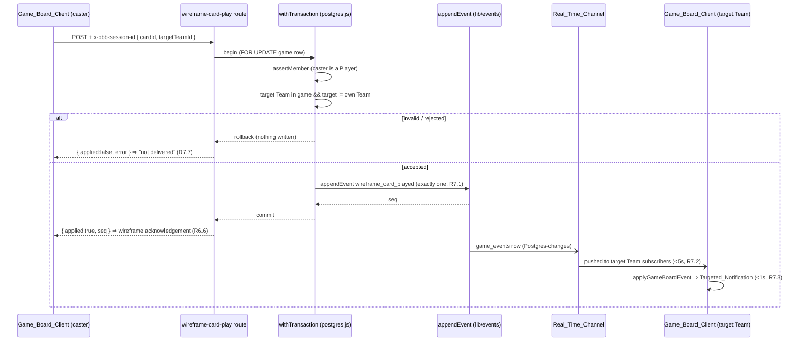

# Design Document

## Overview

**In-Game Landing Wireframe** (ROADMAP U1.x connective shell) is the UI/UX skeleton every
Player and the Admin lands on once a Game transitions `lobby → live`. It establishes the
in-game shell — the `Game_Board` — its three navigable `Region`s (bars, scoreboard, cards),
and placeholder surfaces for capabilities that later roadmap features (F2.x claiming/scoring,
F3.x cards/photos, F4.x endgame/admin) will wire real behavior into.

This design's central principle is the same one the lobby followed: **reuse, not reinvention**.
The foundation and the lobby already provide every mechanism this feature needs:

- **Pure folded-view reducer over `game_events`** — the lobby derives its view by folding the
  append-only log (`lib/lobby/events.ts`: `initialLobbyView` / `foldLobbyEvents` /
  `applyLobbyEvent`). This feature adds an analogous, framework-free `lib/gameboard/` reducer
  (`GameBoardView` + `initial…`/`fold…`/`apply…`) that is the property-test target.
- **Realtime subscribe / snapshot / ordered-apply / reconnect / resume** — `lib/realtime/*`
  (`subscribe`, `applyInOrder`, `ReconnectController`, `ResumeController`,
  `LocalStorageLastSeenStore`, `supabaseBrowser.ts`). The `Game_Board_Client` reuses all of it
  exactly as the lobby page does. This is Requirement 8 wholesale.
- **Session-based identity + RLS** — the per-device Session id is the Supabase Anonymous Auth
  UID, bridged by `lib/session/supabaseSession.ts` (`establishBrowserSession`,
  `bindRealtimeAuth`), sent as the `x-bbb-session-id` header and used as the JWT `sub` RLS
  matches. This is Requirement 1's authorization model.
- **Atomic domain-write + one event** — `withTransaction` (`lib/db/server.ts`) + `appendEvent`
  (`lib/events`), guarded by the shared `_shared.ts` helpers. This is the exact shape
  Requirement 7's single genuinely-wired path needs.

The new code is therefore thin: a **pure `lib/gameboard/` reducer** (folding lifecycle,
teams+colors, and pending targeted notifications), a small **placeholder card model**, the
**mobile-first `Game_Board_Client`** page and its presentational `components/board/*`, and
**one new server route** for the wireframe targeting card play (Requirement 7).

### This is a wireframe, not the game

The regions render **placeholder** content only. This feature implements **no** claiming,
scoring, card draw, card validation, targeting enforcement, photo handling, or game-end logic.
Where it depicts a future behavior (playing a card, being targeted) it renders a **wireframe
interaction** — a placeholder flow anticipating the real feature's shape — never the enforced
rule.

The **one exception** is the card-played-on-you path (Requirement 7): confirming a wireframe
targeting card play appends **exactly one** `game_event` and propagates it over the existing
Realtime backbone so a targeted Team's clients show an immediate `Targeted_Notification`. Even
here, the effect is *only* the notification — it does **not** enforce the "blocked from
claiming until conditions are met" rule (owned by F3.2), does not alter scores, and blocks no
Region or control (R7.6).

### Scope boundaries (from requirements)

- **No real claiming/scoring/cards/photos/game-end.** Regions are placeholders (R3, R4, R5).
- **The `lobby → live` transition is not owned here.** `game-setup-lobby` (F1.3, done) appends
  the `game_started` event; this feature only *consumes* the resulting `live` state and, on the
  lobby page, presents navigation to the board within the propagation window (R1.2).
- **Notification is wired; enforcement is not.** R7 demonstrates immediate real-time delivery,
  not the claiming restriction (F3.2), and never blocks the target Team (R7.6).

## Architecture

### Layering

The feature follows the established three-layer split from the `structure` steering, mirroring
the lobby exactly:

```
components/board/  Game_Board_Client UI (React, mobile-first)   — R2–R6, R9
  ↕ (subscribe + POST)
app/games/[gameId]/board/page.tsx  the Game_Board page          — composition + realtime + roles
app/api/games/[gameId]/wireframe-card-play/route.ts             — one transactional append (R7)
  ↕ (withTransaction + appendEvent)
lib/gameboard/   pure Game_Board reducer + placeholder card model — framework-free, property-tested
  ── reuses ──
lib/realtime (subscribe / applyInOrder / ReconnectController / ResumeController /
              LocalStorageLastSeenStore / supabaseBrowser),
lib/events (appendEvent, GameEvent), lib/db/server (withTransaction),
lib/session/supabaseSession (establishBrowserSession, bindRealtimeAuth),
app/api/games/_shared (requireSession, assertMember, applied/notApplied)
```

The pure `lib/gameboard/` logic performs **no I/O** and is the property-test target. The route
handler owns the transaction boundary, the session/membership authorization, and translating
the result into an HTTP response — exactly as the lobby routes do.

### Route & landing

The `Game_Board` lives at **`app/games/[gameId]/board/page.tsx`** (sibling to
`app/games/[gameId]/lobby/page.tsx`). Landing after start reuses the lobby's existing fold:
when the lobby page folds a `game_started` event (lifecycle → `live`), it presents a control
that navigates to `/games/{gameId}/board` within the propagation window (R1.2). Opening the
board directly resolves the same way the lobby does — via the folded `lifecycle` plus the
durable per-game role facts (`bbb:admin:{gameId}`, `bbb:player:{gameId}`) — and gates rendering
on lifecycle and membership (R1.1, R1.3–R1.6).

### Board access gate (Requirement 1)

Before rendering any Region the page derives an **access decision** from the folded view and
the resolved Session, computed by a pure helper `selectBoardAccess` (mirroring
`selectLobbyEntry`):

| Condition                                                        | Decision            | Renders                                            |
| ---------------------------------------------------------------- | ------------------- | -------------------------------------------------- |
| No valid Session (async auth unresolved / failed)                | `no-session`        | establish-session prompt; **no** Game_Board (R1.6) |
| Session is neither Admin nor Player of the Game                  | `not-authorized`    | not-authorized notice; **no** Regions (R1.5)       |
| `lifecycle === "lobby"`                                          | `redirect-lobby`    | redirect to `/games/{id}/lobby`; **no** Regions (R1.3) |
| `lifecycle === "ended"`                                          | `ended`             | ended-game indication; **no** Regions (R1.4)       |
| `lifecycle === "live"` and Session is Admin or Player            | `board`             | the Game_Board with all three Regions (R1.1)       |

Only the `board` decision renders the Bars/Scoreboard/Cards Regions; every other decision
renders its indication and omits the Regions (R1.3–R1.6).

### Request flow (the one write path — Requirement 7)

The single genuinely-wired mutation is the wireframe targeting card play. It is one server
route that mirrors `teams/select/route.ts`:

1. `requireSession` reads `x-bbb-session-id` (R1.6/identity); no session → 401, nothing written.
2. `withTransaction` opens one transaction; `assertMember` locks the game row `FOR UPDATE` and
   confirms the Session is a member (Player) of the game.
3. Validate that the target Team belongs to this game (composite integrity) and is **not** the
   caller's own Team.
4. `appendEvent` appends **exactly one** `wireframe_card_played` event `{ castingTeamId,
   targetTeamId, cardId }` (R7.1). No score/claim mutation, no blocking.
5. Any throw rolls back — no event written; the route returns a structured failure so the
   client shows "not delivered" and no success acknowledgement (R7.7).



### Read / propagation flow (Requirement 8)

The `Game_Board_Client` uses `lib/realtime` unchanged, identical to the lobby page:

- On mount, after the async Supabase-auth Session resolves: fetch prior events and seed the
  view with `foldGameBoardEvents` (ordered fold, R8.2), then `subscribe(gameId, { transport,
  snapshotSource, lastSeenStore, handlers: { onEvent } })` opens the per-game channel (R8.1,
  R8.4).
- Live events flow through the ordered-apply core (`applyInOrder` inside `subscribe`), applied
  in ascending `seq` and de-duplicated at/below the contiguous frontier (R8.3); each applied
  event folds into the `GameBoardView` via `applyGameBoardEvent`.
- Connection loss uses `ReconnectController` (≤5s intervals, ≤12 attempts, then terminal
  "reload required", R8.5, R8.7).
- Resume/relaunch uses `ResumeController` bound to visibility/focus (catch-up from the persisted
  watermark before resuming live delivery, R8.6).
- Subscription/snapshot failure surfaces a "live updates unavailable, reload required" notice
  and never presents partially-applied state as live (R8.8).

Because a targeting `game_event` flows through this same pipeline, the `Targeted_Notification`
(R7) is produced by folding that event into the view — no bespoke notification channel.

## Components and Interfaces

### 1. `lib/gameboard/events.ts` — pure Game_Board reducer

Framework-free, no I/O; the property-test target. Mirrors `lib/lobby/events.ts` and reuses the
`GameEvent` shape and the same idempotence guard (`seq <= lastSeenSequence` ⇒ ignore).

```ts
/** Event types this reducer interprets (a superset of the lobby types it needs). */
export const GAME_BOARD_EVENT_TYPES = {
  gameCreated: "game_created",
  teamCreated: "team_created",
  gameStarted: "game_started",
  gameEnded: "game_ended",              // sets lifecycle → "ended" (R1.4)
  wireframeCardPlayed: "wireframe_card_played", // targeting notification (R7)
} as const;

export type GameBoardLifecycle = "lobby" | "live" | "ended";

export interface BoardTeamView {
  readonly id: string;
  readonly name: string;
  readonly color: string;
}

/** One pending targeted notification folded from a wireframe_card_played event (R7). */
export interface TargetedNotice {
  /** The event seq that produced it — the stable identity used for de-dup + dismissal. */
  readonly seq: number;
  readonly castingTeamId: string;
  readonly targetTeamId: string;
  readonly cardId: string;
}

export interface GameBoardView {
  readonly gameId: string;
  readonly lifecycle: GameBoardLifecycle;
  readonly teams: BoardTeamView[];
  /** Notices whose targetTeamId is the viewing team; one per targeting event (R7.8). */
  readonly targetedNotices: TargetedNotice[];
  readonly lastSeenSequence: number;
}

export function initialGameBoardView(gameId: string): GameBoardView;

/** Fold one event (idempotent; ignores seq <= lastSeenSequence; rejects foreign gameId). */
export function applyGameBoardEvent(view: GameBoardView, event: GameEvent): GameBoardView;

/** Ordered fold of prior events (sorts by seq asc, reduces from initial). */
export function foldGameBoardEvents(gameId: string, events: readonly GameEvent[]): GameBoardView;

/** Remove a folded notice by its producing event seq (R7.5 dismissal). */
export function dismissTargetedNotice(view: GameBoardView, seq: number): GameBoardView;
```

Fold semantics:

- `game_created` / `team_created` build `teams` (id, name, color) — the reducer reads the same
  payloads the lobby routes append, so the scoreboard has real Team identities/colors to render
  (R4.1, R4.2).
- `game_started` sets `lifecycle = "live"`; `game_ended` sets `lifecycle = "ended"` (R1.4).
- `wireframe_card_played` appends a `TargetedNotice { seq, castingTeamId, targetTeamId, cardId }`.
  Because the reducer is fed only the game's own events and the fold is idempotent on `seq`, each
  targeting event yields **exactly one** notice (R7.8), and re-delivery never duplicates it (R8.3).
- Notices are folded for **all** teams in the view; the client filters to the notices whose
  `targetTeamId` is the current Player's Team when deciding what to present (R7.3). This keeps
  the reducer pure and team-agnostic (the caster's own client, being on a different team, will
  fold the same event but not surface it — R7 is about the *target*).

### 2. `lib/gameboard/placeholderCards.ts` — placeholder card model

Pure, deterministic placeholder hand generator so the Cards_Region and card-play wireframe have
stable data without any real draw logic (R5.2, R6.2/R6.3).

```ts
export interface PlaceholderCard {
  readonly id: string;
  readonly label: string;
  /** true ⇒ playing it targets another Team (drives the target-selection step, R6.2/R6.3). */
  readonly targetsTeam: boolean;
}

/** A stable placeholder hand of between 1 and 8 cards (R5.2), seeded by playerId for determinism. */
export function placeholderHand(playerId: string): PlaceholderCard[];
```

### 3. `app/games/[gameId]/board/page.tsx` — the Game_Board (client composition)

The one client surface, mirroring the lobby page's structure (async Supabase-auth Session →
subscribe + snapshot fold + ordered apply + reconnect + resume; role derivation from durable
per-game facts; unconfigured-env resilience). It owns:

- **Session identity** via `establishBrowserSession` / `bindRealtimeAuth`; gates POSTs and the
  subscription on the resolved id.
- **Access decision** via `selectBoardAccess(view.lifecycle, isAdmin, isPlayer)` — renders one
  of the five decisions above; only `board` renders Regions (R1).
- **Active-Region state** — exactly one of `"bars" | "scoreboard" | "cards"`, initialized to
  `"bars"` (R2.3); navigation switches it (R2.2), and re-selecting the active one is a no-op
  (R2.7). Rendered by a `RegionNav` with the active control visually distinguished (R2.4) and
  all three always operable (R2.5).
- **Card-play wireframe state** and **notification queue** — opening/confirming/cancelling the
  `CardPlayWireframe` (R6), and the list of `Targeted_Notification`s derived from
  `view.targetedNotices` filtered to the current Team (R7.3/R7.8), each dismissable (R7.5).
- **The one POST** — `POST /api/games/{gameId}/wireframe-card-play` on confirm of a targeting
  card, surfacing "not delivered" on failure (R7.7).

### 4. `components/board/*` — presentational components

All mobile-first (single-column, ≥44×44px touch targets — R9):

- `RegionNav` — three navigation controls (R2.1); active control visually distinguished (R2.4);
  all three always displayed/operable (R2.5); each ≥44×44px (R9.2).
- `BarsRegion` — placeholder view surface (R3.1), a placeholder claim control labeled as
  claiming a bar (R3.2, ≥44×44px R9.3), a "provided by a later feature" label (R3.3); activating
  the claim control shows a wireframe acknowledgement (R3.4) and changes nothing (R3.5); when the
  Session is Admin-and-not-a-Player it shows "claiming belongs to Players" instead of an operable
  control (R3.6).
- `ScoreboardRegion` — one placeholder row per Team (2–4 rows, R4.1) showing the Team color
  (R4.2), a placeholder score (R4.3), a placeholder claimed-bars area (R4.4), and a
  "later feature" label (R4.5).
- `CardsRegion` — placeholder hand surface (R5.1) of 1–8 placeholder cards each with a play
  control (R5.2), a "later feature" label (R5.3); when Admin-and-not-a-Player it shows
  "a hand belongs to Players" instead of a hand (R5.4).
- `CardPlayWireframe` — presented on play (R6.1); for a targeting card it lists every **other**
  Team excluding the caller's own Team (R6.2), for a non-targeting card it omits target selection
  and shows confirm directly (R6.3); selecting a target shows a confirmation naming it (R6.4);
  confirming a targeting card without a selected target shows "target required" and does not
  complete (R6.5); confirm shows a wireframe acknowledgement and enforces nothing (R6.6); cancel
  dismisses and leaves the region unchanged (R6.7). Fits within 320–430px without horizontal
  scroll (R9.4).
- `TargetedNotification` — presents the casting Team (R7.3), a "effect/restriction is a later
  feature" label (R7.4), and a dismiss control (R7.5, ≥44×44px R9.3); never obscures the Region
  nav (R9.5) and blocks nothing (R7.6).

### 5. `app/games/[gameId]/wireframe-card-play/route.ts` — the one server route

`runtime = "nodejs"` (the `postgres` driver needs a real socket). Mirrors `teams/select`.

Request:

```
POST /api/games/{gameId}/wireframe-card-play
Header: x-bbb-session-id: <session>
Body:   { cardId: string, targetTeamId: string }
```

Responses (reusing `_shared.ts` `applied`/`notApplied`):

| Status | Body                              | When                                                     |
| ------ | --------------------------------- | -------------------------------------------------------- |
| 200    | `{ applied: true, seq }`          | one `wireframe_card_played` event written (R7.1)         |
| 401    | `{ applied: false, error: "missing_session" }` | no valid Session                            |
| 403    | `{ applied: false, error: "not_member" }`      | Session is not a Player of the game         |
| 404    | `{ applied: false, error: "not_found" }`       | target Team not in game / same as own Team  |
| 500    | `{ applied: false, error }`       | transaction rolled back — nothing written (R7.7)         |

The route validates membership, that the target Team belongs to the game and differs from the
caller's own Team, then `appendEvent`s exactly one event (actor: the caster's Team). It performs
**no** score/claim mutation and enforces **no** blocking (R7.6).

### 6. Reused foundation pieces (unchanged)

- `lib/realtime`: `subscribe`, `applyInOrder`, `ReconnectController` + `makeReconnectAttempt`,
  `ResumeController` + `bindResumeSignals`, `LocalStorageLastSeenStore`, `supabaseBrowser`
  (`createBrowserSupabaseClient`, `isSupabaseConfigured`, `supabaseRealtimeTransport`,
  `supabaseSnapshotSource`).
- `lib/session/supabaseSession`: `establishBrowserSession`, `bindRealtimeAuth`.
- `lib/events`: `appendEvent`, `GameEvent`. `lib/db/server`: `withTransaction`.
- `app/api/games/_shared`: `requireSession`, `assertMember`, `applied`, `notApplied`.

## Data Models

### `GameBoardView` (folded client state)

```ts
interface GameBoardView {
  gameId: string;
  lifecycle: "lobby" | "live" | "ended";      // drives the access gate (R1)
  teams: { id: string; name: string; color: string }[];  // scoreboard rows + target list
  targetedNotices: {                          // one per wireframe_card_played event (R7.8)
    seq: number;                              // stable identity for de-dup + dismissal
    castingTeamId: string;
    targetTeamId: string;
    cardId: string;
  }[];
  lastSeenSequence: number;                    // idempotence watermark (mirrors lobby/realtime)
}
```

### `PlaceholderCard` (wireframe hand)

```ts
interface PlaceholderCard {
  id: string;
  label: string;
  targetsTeam: boolean;   // true ⇒ CardPlayWireframe shows target selection (R6.2)
}
```

### `wireframe_card_played` event payload (appended to `game_events`)

The one new event type this feature writes. Actor is the casting Team; payload:

```jsonc
{
  "castingTeamId": "team-uuid",   // the Team that played the card
  "targetTeamId":  "team-uuid",   // the targeted Team (folded into TargetedNotice)
  "cardId":        "placeholder-card-id"
}
```

It rides the existing `game_events` table (per-game `seq`, `<=16 KB` payload, UTC-ms
`created_at`) — no schema change. The reducer folds it into a `TargetedNotice`; the target
Team's client surfaces it as a `Targeted_Notification`.


## Correctness Properties

*A property is a characteristic or behavior that should hold true across all valid executions
of a system — essentially, a formal statement about what the system should do. Properties serve
as the bridge between human-readable specifications and machine-verifiable correctness
guarantees.*

These properties target the **pure, framework-free** logic: the `lib/gameboard/` reducer and
model, the access-decision helper, and the active-region transition. UI presentation, timing,
Realtime delivery, and the reconnect/resume machinery (reused from `lib/realtime`, already
property-tested there) are covered by example/integration/viewport tests in the Testing
Strategy, not by new properties.

### Property 1: Board access decision is exhaustive and gated

*For any* combination of Session presence, membership role (Admin, Player, or neither), and
Game `lifecycle` (`lobby`, `live`, `ended`), `selectBoardAccess` returns exactly one decision,
and it returns the region-rendering `board` decision **if and only if** a valid Session is
present, the Session is the Admin or a Player of the Game, and `lifecycle` is `live`; every
other input yields a non-`board` decision that renders no Region.

**Validates: Requirements 1.1, 1.3, 1.4, 1.5, 1.6**

### Property 2: Region transition selects the target and is idempotent on the active one

*For any* current active Region and any target Region, selecting the target Region makes the
target the active Region; and selecting the Region that is already active returns an equal state
(no change to which Region is displayed).

**Validates: Requirements 2.2, 2.7**

### Property 3: Exactly one Region is active

*For any* sequence of Region selections applied to the initial Game_Board state, the resulting
active Region is exactly one of the three Regions — never zero and never more than one.

**Validates: Requirements 2.6**

### Property 4: Canonical, idempotent, ordered fold

*For any* set of a Game's Game_Events delivered in any order and with arbitrary duplicates,
`foldGameBoardEvents` produces the same `GameBoardView` as applying the events once each in
ascending `seq` order to the initial view; equivalently, applying an event whose `seq` is at or
below the highest contiguously-applied `seq` leaves the view unchanged.

**Validates: Requirements 8.2, 8.3**

### Property 5: The reducer only folds its own Game's events

*For any* `GameBoardView` and any Game_Event whose `gameId` differs from the view's `gameId`,
`applyGameBoardEvent` rejects the event (it does not fold another Game's event into the view).

**Validates: Requirements 8.4**

### Property 6: Scoreboard renders one row per Team with color, score, and claimed-bars

*For any* `GameBoardView` with between 2 and 4 Teams, the Scoreboard_Region renders exactly one
placeholder row per Team, and each row surfaces that Team's color, a placeholder score value,
and a placeholder claimed-bars area.

**Validates: Requirements 4.1, 4.2, 4.3, 4.4**

### Property 7: Placeholder hand size is bounded

*For any* Player id, `placeholderHand` returns between 1 and 8 placeholder cards (inclusive),
each with a distinct id.

**Validates: Requirements 5.2**

### Property 8: Target list excludes own Team and includes every other Team

*For any* set of Teams in a Game and any choice of the current Player's own Team within that set,
the target-selection options for a targeting card contain every other Team in the Game and never
contain the current Player's own Team.

**Validates: Requirements 6.2**

### Property 9: Each targeting event yields exactly one notice naming its caster

*For any* set of distinct `wireframe_card_played` Game_Events whose target Team is the viewing
Team, folding them produces exactly one `TargetedNotice` per event, each identifying the casting
Team of its originating event (and no notice for events targeting a different Team).

**Validates: Requirements 7.3, 7.8**

### Property 10: Dismissing removes exactly the named notice

*For any* `GameBoardView` and any notice present in it, dismissing that notice (by its producing
event `seq`) yields a view that no longer contains that notice and still contains every other
notice unchanged.

**Validates: Requirements 7.5**

## Error Handling

The feature has one write path and one read pipeline; error handling mirrors the lobby.

- **Wireframe card-play append failure (R7.7).** The route runs the append inside
  `withTransaction`; any throw rolls the transaction back, so **no** `game_event` is written.
  The route returns a structured `{ applied: false, error }` (500 on an unexpected failure, or a
  reason-mapped 4xx for a rejected request). The client treats any non-`applied` response as
  "not delivered": it shows a delivery-failed indication and does **not** show a success
  wireframe acknowledgement.
- **Invalid card-play request.** No session → `401 missing_session` (nothing written). Session
  is not a Player of the game → `403 not_member`. Target Team not in the game, or equal to the
  caller's own Team → `404 not_found`. All reuse `_shared.ts` `notApplied`.
- **Subscription / snapshot load failure (R8.8).** If `subscribe` or the pre-subscription
  snapshot fetch rejects when opening the board for a live Game, the page enters an `error`
  status and shows a "live updates unavailable — reload required" notice, and does **not**
  present partially-applied Game state as live (it does not render the Regions as a live board).
- **Reconnect exhaustion (R8.5/R8.7).** `ReconnectController` retries on the bounded ≤5s /
  ≤12-attempt schedule; on the 12th failed attempt it transitions to a terminal state and the
  page surfaces a "connection lost — reload to reconnect" banner (identical to the lobby).
- **Resume/relaunch (R8.6).** `ResumeController` catches up exactly the missed tail (events with
  `seq` greater than the persisted watermark, ascending) before resuming live delivery, and can
  pull a terminal reconnect controller back out on foreground.
- **Board access denials (R1).** Non-member → not-authorized indication; `lobby` → redirect to
  the lobby; `ended` → ended indication; no valid Session → establish-session prompt. In every
  case the Bars/Scoreboard/Cards Regions are not rendered.
- **Unconfigured environment.** When Supabase is not configured (`isSupabaseConfigured()` is
  false) the page renders the shell and a clear "real-time not configured" notice rather than
  crashing, and never opens a connection — the same resilience path the lobby and demo pages use.
- **Placeholder controls (R3.5/R6.6).** The placeholder claim control and the wireframe card
  confirmation are inert: they never POST, never append an event, never alter score/claims, and
  never block a Region — a class of "must do nothing" behaviors verified by example tests.

## Testing Strategy

**Dual approach.** Property-based tests verify the universal behaviors of the pure reducer,
model, access decision, and region transition (Properties 1–10). Example, integration, and
viewport tests cover the concrete UI, the one server route, the reused realtime wiring, and the
mobile layout that property tests cannot express.

**Property-based tests (fast-check, Vitest).** PBT applies here because the core logic is pure
with a large input space (arbitrary event logs, team sets, region-selection sequences, player
ids). Existing suites in the repo (`lib/lobby/*.property.test.ts`, `lib/realtime/*.property.test.ts`)
are the pattern to follow.

- Library: **fast-check** with **Vitest** (already the project standard). Do **not** hand-roll
  property testing.
- Each property test runs a **minimum of 100 iterations**.
- Each property test is tagged with a comment referencing its design property, in the format:
  **Feature: in-game-landing-wireframe, Property {number}: {property text}**.
- One property test per property:
  - P1 → `lib/gameboard/access.property.test.ts` (generate session/role/lifecycle; assert the
    decision and the region-rendering iff).
  - P2, P3 → `lib/gameboard/region.property.test.ts` (transition select + idempotence; and a
    random selection sequence always yields exactly one active Region).
  - P4, P5 → `lib/gameboard/events.property.test.ts` (shuffled/duplicated event logs fold to the
    ascending-seq fold; foreign-`gameId` events are rejected).
  - P9, P10 → `lib/gameboard/notices.property.test.ts` (N targeting events → N notices naming
    casters; dismiss removes exactly one) — may live in the same `events.property.test.ts`.
  - P6 → `components/board/ScoreboardRegion.property.test.tsx` (2–4 team views render one
    row/team with color, score, claimed-bars).
  - P7 → `lib/gameboard/placeholderCards.property.test.ts` (hand size 1–8, distinct ids).
  - P8 → `components/board/CardPlayWireframe.property.test.tsx` (target options exclude own Team,
    include all others).

**Example / unit tests (Vitest, jsdom for components).** Cover specific interactions and
branches:

- Access/landing: R1.2 lobby presents board navigation after folding `game_started`; R8.8
  subscription/snapshot failure shows the unavailable/reload notice.
- Region nav: R2.1 exactly three controls; R2.3 initial active is Bars; R2.4 active control
  distinguished (e.g. `aria-current`).
- Bars: R3.1/R3.2/R3.3 surfaces + labels; R3.4 acknowledgement on activation; R3.5 inert (no
  fetch/append, region unchanged); R3.6 admin-not-player players-only indication.
- Cards: R5.1/R5.3 surface + label; R5.4 admin-not-player indication.
- Card play: R6.1 opens wireframe; R6.3 non-targeting omits selector, shows confirm; R6.4
  selecting a target shows a naming confirmation; R6.5 confirm-without-target shows "target
  required" and does not complete; R6.6 acknowledgement + no enforcement; R6.7 cancel dismisses
  and leaves the region unchanged.
- Notification: R7.1 route appends exactly one event (fake `QueryRunner`, assert a single
  `appendEvent` carrying the target); R7.4 later-feature label; R7.6 does not block nav/regions;
  R7.7 append failure shows "not delivered", no success acknowledgement.
- Realtime wiring: R8.1 board subscribes with the game id on open; R8.5/R8.6/R8.7 the board
  wires `ReconnectController` and `ResumeController` (behavior itself is already property-tested
  in `lib/realtime`, so these are wiring/example checks, not re-proofs).

**Integration tests.** R7.2 (Realtime delivery to target-Team subscribers within 5s) and R8.4
(channel isolation) exercise Supabase Realtime — external infrastructure, not our logic — so
they use 1–3 representative examples against a live or mocked channel, reusing the foundation's
transport rather than re-testing it here.

**Viewport / mobile tests (`*.viewport.test.tsx`, jsdom).** Mirror
`app/games/[gameId]/lobby/page.viewport.test.tsx` and `app/page.viewport.test.tsx`: render the
board (and the `CardPlayWireframe`) across the 320–430px band and assert single-column flex +
`box-sizing: border-box` + no fixed px width exceeding the viewport (R9.1/R9.4), the
`globals.css` `overflow-x` guard, and that every interactive control (nav, claim, card play,
dismiss) declares a ≥44×44px touch target (R9.2/R9.3). Assert that an active
`TargetedNotification` leaves the Region nav controls present and operable (R9.5). As in the
lobby suite, jsdom performs no real layout, so these assert the overflow-preventing guards and
touch-target declarations rather than measured pixels; true rendered-overflow checks are left to
a browser/Playwright integration pass.
