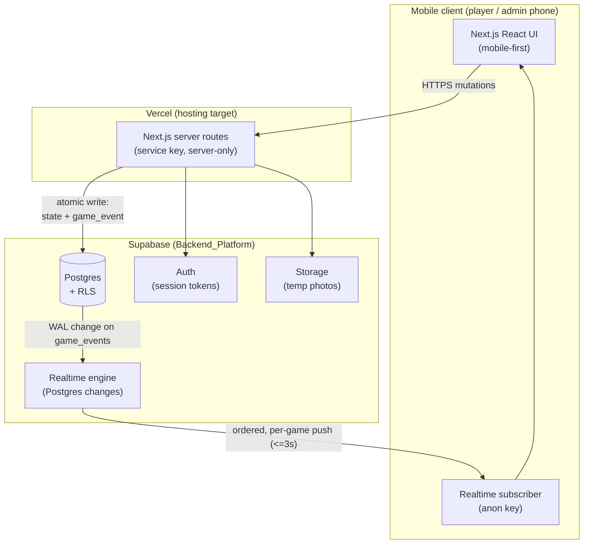
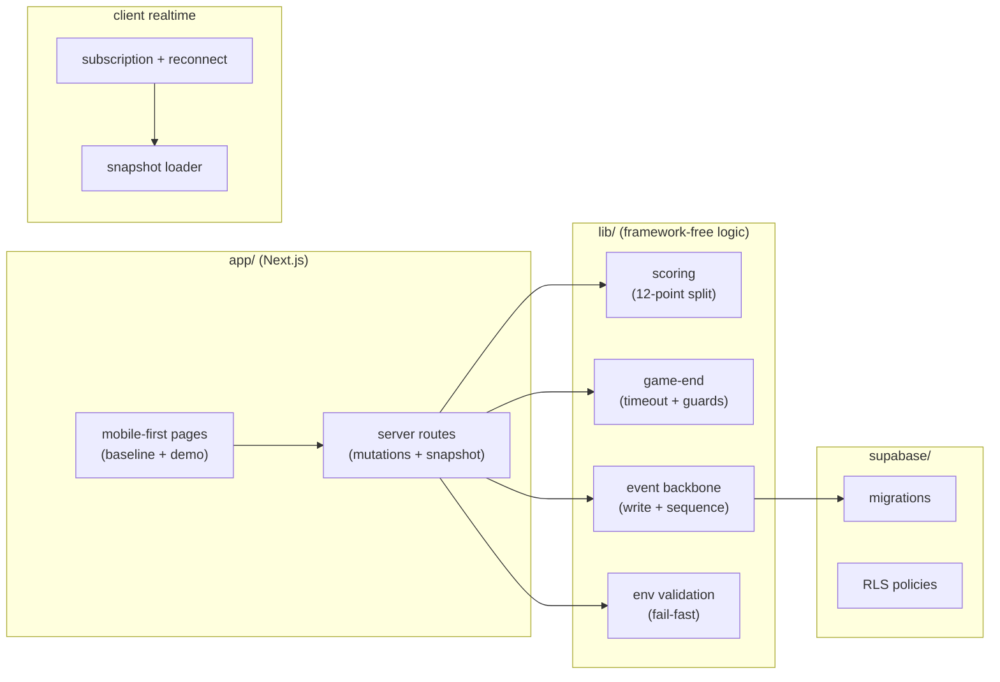
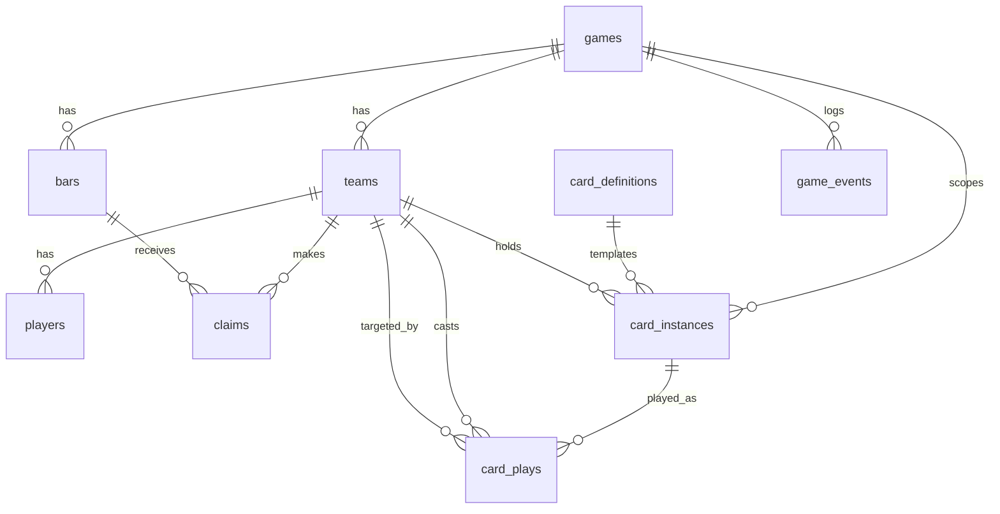

# Design Document

## Overview

This design establishes the technical foundation for the Beltline Bar Brawl (BBB) web
application. It resolves the stack/hosting decision (F0.1), defines the project scaffold
(F0.2), and specifies the persistent data schema plus the real-time propagation backbone
(F0.3) that every later feature depends on.

The design is driven by one dominant constraint: **near-real-time propagation of game
state changes**. In v0, cards played against a team arrived by group text up to 15 minutes
late, which was unfair in a game where time is a scored resource. This foundation must prove
that a persisted state change reaches every subscribed client within a 3-second
`Latency_Budget`, and it must lay down a schema that models the *full* v1 game so later
features (lobby, claiming/scoring, cards, endgame) extend the schema rather than redesign
it.

Scope boundary: this spec produces **decisions, scaffolding, schema, and a working
propagation demonstration**. It does not implement game features. Where game logic is
referenced (scoring split, card targeting, game-end conditions) it is only to
ensure the schema and event backbone can support it later. Claiming is trusted: a team taps
"claim" and the claim is recorded — the foundation does not verify drink completion or
"at least half" team participation.

### Key Decisions At A Glance

| Concern | Decision | Rationale (short) |
|---|---|---|
| Hosting target | **Vercel** | First-class Node/Next.js hosting, preview deploys, mobile-fast edge CDN. |
| Backend platform | **Supabase** | Managed Postgres + real-time subscriptions + auth + storage in one service; real-time is the make-or-break capability and Supabase delivers it out of the box. |
| Framework | **Next.js (App Router) on Node.js** | One repo for UI + server routes, mobile-first React, native Vercel target. |
| Identity model | **Lightweight per-game session** (see F0.1 decision) | Players are walking a bar crawl; a code/link + display name removes signup friction. Admin gets a lightweight host credential. |
| Photo lifecycle | **Supabase Storage, 24h retention, admin/self takedown** | Photos are transient validation artifacts; short retention limits privacy exposure. |
| Real-time channel | **Supabase Postgres Changes on `game_events`** | The append-only events log is the single ordered source; subscribing to it gives ordered, per-game delivery. |
| Access isolation | **Postgres Row-Level Security (RLS) keyed by game membership** | Enforces per-game isolation at the database, not just the app layer. |

The remainder of this document works through the hosting tradeoff in full (the
`Hosting_Decision_Record` is embedded in the Architecture section), then the scaffold, data
models, correctness properties, error handling, and testing strategy.

---

## Architecture

### High-Level Shape



**Write path (the important one):** all `Game_State_Change` mutations go through Next.js
server routes (never directly from the browser). A server route opens a single database
transaction that writes the domain rows **and** appends exactly one `game_event`. On commit,
Supabase Realtime observes the new `game_events` row via the Postgres write-ahead log and
pushes it to every client subscribed to that game.

**Read/subscribe path:** a client subscribes to the realtime channel for its game and,
in the same flow, fetches an initial state snapshot. From then on it applies incoming
`game_events` in sequence order to keep its local view current.

### Why the events log is the backbone

Rather than broadcasting each feature's changes ad hoc, every state change becomes a row in
one append-only `game_events` table. This gives us three things for free:

1. **Ordering** — a per-game strictly-increasing sequence defines a total order of events.
2. **Propagation** — clients subscribe to one table filtered by `game_id`.
3. **History / resync** — a reconnecting client asks for events after its last-seen sequence
   (or a fresh snapshot), so no change is silently missed.

This is the single mechanism that fixes the v0 latency problem and doubles as the audit log.

### Game-end behavior (Requirement 5)

A game leaves the `live` state in one of two ways this spec models (a third, finish-bar
claimed, is a later feature but shares the same `end_reason` enum on `games`):

- **Admin-ended (Req 5.1):** the Admin ends a live game. The game transitions to `ended`
  with `end_reason = admin_ended`.
- **Auto-timeout (Req 5.2):** if **12 hours** elapse after `live_started_at` without the game
  having ended, the game transitions to `ended` with `end_reason = auto_timeout`. This bounds
  how long a game can stay live when play simply stops.

**Auto-timeout trigger mechanism.** The deterministic predicate is
`now - live_started_at ≥ 12h` (`isDueForAutoTimeout`). Something must *apply* that predicate.
Two approaches:

1. **Scheduled sweep (recommended):** a **Supabase scheduled function** (pg_cron / scheduled
   Edge Function) runs periodically (e.g., every few minutes), selects live games whose
   `live_started_at` is more than 12h in the past, and ends each one. This guarantees a game
   ends even if no client ever touches it again — the right behavior for a timeout whose whole
   point is that play has stopped.
2. **Lazy check-on-access:** evaluate the predicate whenever a game is read/mutated and end it
   then. Simpler, but a fully abandoned game never gets accessed and so never ends, defeating
   the requirement.

We **recommend the scheduled sweep** as the authoritative trigger, optionally combined with a
lazy check on access for promptness. Either way, the actual transition goes through the same
atomic write below.

**Every end transition is a `Game_State_Change` (Req 5.3).** Ending a game — whether
admin-ended or auto-timeout — writes the `ended` lifecycle (and `end_reason`) **and** appends
exactly one `game_event` in the same atomic operation defined in Requirement 4. It is just
another state change on the backbone, so subscribed clients observe the end in real time like
any other event.

**Guards (Req 5.4, 5.5).** Ending is permitted **only** from the `live` state
(`canEndGame`). Ending a `lobby` game or re-ending an already-`ended` game is rejected and
leaves the lifecycle and any recorded `end_reason` unchanged. These rejections are covered in
the "Invalid game transitions" error-handling subsection.

### F0.1 — Hosting Decision Record

This section **is** the `Hosting_Decision_Record` (Requirement 1). It compares the
Vercel + Supabase option against an AWS alternative, records a per-capability pass/fail
verdict, gives a rough monthly cost per option, and records the locked choice and the
folded-in identity and photo decisions.

#### Per-capability verdict

Verdicts are sized for **one concurrent game: up to 4 teams × 4 players + 1 admin = 17
clients**.

| Capability | Vercel + Supabase | AWS alternative | Notes |
|---|---|---|---|
| Real-time propagation within 3s | **PASS** | **PASS** | Supabase Realtime pushes Postgres changes in well under 3s at this scale. AWS can match it with AppSync subscriptions or API Gateway WebSockets + DynamoDB Streams, but requires assembling several services. |
| Managed Postgres | **PASS** | **PASS** | Supabase = managed Postgres directly. AWS = RDS/Aurora Postgres. |
| Authentication | **PASS** | **PASS** | Supabase Auth built in. AWS = Cognito. |
| File / photo storage | **PASS** | **PASS** | Supabase Storage with lifecycle. AWS = S3 with lifecycle rules. |
| Mobile-first web delivery | **PASS** | **PASS** | Vercel edge CDN serves the Next.js app globally. AWS = CloudFront + Amplify/Lambda. |

Both options **pass** every capability. The decision therefore turns on integration effort,
operational surface, and cost at our small scale — not raw capability.

**Real-time capability detail (Req 1.3):** the deciding capability is real-time. On
Vercel + Supabase the path is `Postgres commit → WAL → Realtime → client`, a single managed
pipeline with sub-second push at 17 clients — comfortably inside the 3s budget. On AWS the
equivalent path (`DynamoDB Streams → Lambda → AppSync/API Gateway WS → client`, or Aurora +
a change pipeline) is also inside budget but is several services the team must wire and
operate. Verdict: both PASS; Supabase reaches PASS with far less assembly.

#### Rough monthly cost estimate (USD, single concurrent game)

| Option | Monthly estimate (USD) | Basis |
|---|---|---|
| **Vercel + Supabase** | **~$0–25/mo** | Both have free tiers that cover one small intermittent game (17 clients, low storage, short-lived photos). Realistic paid floor if upgrading past free limits: Supabase Pro ~$25/mo; Vercel Hobby $0 for non-commercial. Estimate: **$0 on free tiers, ~$25/mo if Supabase Pro is needed.** |
| **AWS alternative** | **~$30–70/mo** | RDS/Aurora Postgres (smallest instance ~$15–30/mo even mostly idle), AppSync or API Gateway WebSockets (usage-based, low at this scale), S3 + CloudFront (a few dollars), Cognito (free at this volume). Dominated by the always-on database instance. Estimate: **~$30–70/mo**, higher floor because managed Postgres is not free-tier-friendly for sustained use. |

These are rough figures for planning, not quotes; both scale cheaply at single-game volume,
and the gap is driven mainly by AWS's always-on database floor versus Supabase's free tier.

#### Locked choice and rationale (Req 1.5)

**Locked choice: Vercel (hosting) + Supabase (Backend_Platform).**

Rationale: at single-game scale both options are capable, so we optimize for **least
integration effort and lowest operational surface**. Supabase bundles the four backend
capabilities (Postgres, auth, realtime, storage) behind one service and one client library,
and its realtime feature directly solves the primary v0 problem with no assembly. Vercel is
the native host for Next.js with zero-config preview deployments that make the
`Deployable_Baseline` and mobile testing trivial. The AWS path delivers the same
capabilities but multiplies the number of services to wire, secure, and pay for, with a
higher fixed monthly floor and no offsetting benefit at this scale.

**Deviation from technical direction (Req 1.6):** none. `tech.md` named Supabase as the
leading candidate; this decision confirms it. No deviation reason is required. If future
scale (many concurrent games, heavier media) changes the tradeoff, the AWS plan below is the
fallback.

#### Identity_Model decision (Req 1.7)

**Decision: lightweight per-game session identity.**

- A game is created by an **admin** who receives a host credential (a session bound to that
  game). Players **join via a code/link** and pick a display name and team; each player gets
  a per-game session token, not a global account.
- Rationale: BBB is a one-evening, in-person bar crawl. Requiring signup/email verification
  adds friction at the exact moment a group is trying to start playing on the sidewalk.
  Per-game sessions are enough to attribute claims, card plays, and events to the right
  team, which is all the game logic needs.
- Consequence for the schema (Req 3.15): because identity is **not** account-based, players
  and admin are modeled as per-game rows (`players`, and an admin identity on `games`),
  **not** as persistent cross-game identity records. Supabase Auth is still used to issue and
  validate the per-game session tokens that RLS keys off of.

#### Photo_Lifecycle_Policy decision (Req 1.8)

**Decision:**
- **Storage location:** Supabase Storage, in a dedicated bucket per environment
  (`photo-feed`), objects namespaced by `game_id`.
- **Retention duration:** **24 hours** from upload, after which objects are deleted by a
  scheduled lifecycle job. Photos are validation/feed artifacts, not durable content, so
  short retention minimizes privacy exposure.
- **Takedown:** a photo can be removed before expiry by the uploading team (self) or the
  admin (moderation). Deletion removes the storage object and marks the referencing feed
  event as redacted (the `game_event` itself stays, but its photo reference is nulled).

Photo *handling logic* (upload, feed, challenge) is deferred to F3.3; this spec only fixes
the policy and ensures the schema/storage can hold it.

#### Deferred decisions (Req 1.9, 1.10)

| Deferred item | Resolved by | Reason for deferral |
|---|---|---|
| Full AWS-alternative build plan / detailed cost model | **(fallback only)** | AWS is the alternative, not the chosen path; a detailed build plan is only produced if we migrate. The rough comparison above satisfies F0.1. |
| Bar selection mechanism (map API vs. predetermined list + propose-a-bar) | **F2.1 — Bar selection & discovery** | Depends on how heavy map API integration proves to be; not needed to lock the foundation. |
| Map / claim visualization (map API vs. in-house coordinates vs. list) | **F2.3 — Claim visualization** | UI-layer decision that builds on claiming; out of scope for the foundation. |

### Environment topology

Three environments, each with its own Supabase project (or schema) and its own secrets:

- **local** — developer machine, `.env.local`, a local or shared dev Supabase project.
- **preview** — Vercel preview deployments per branch/PR, preview env vars.
- **production** — Vercel production, production Supabase project.

---

## Components and Interfaces

The foundation is intentionally thin. It defines the seams later features plug into.

### Component map



### 1. Environment configuration (`lib/env`)

- **Responsibility:** load and validate environment variables at startup; fail fast.
- **Interface:** a single `loadEnv()` that returns a typed, frozen config object or throws
  a startup error listing **every** missing/empty required variable by name.
- **Behavior (Req 2.9):** invoked before the server accepts requests. If any required
  variable is missing or empty, it throws before the HTTP server starts listening, leaving
  the app in a not-started state. The error message enumerates all offending variable names
  (not just the first).
- **Variable classes:**
  - Public (browser-safe, `NEXT_PUBLIC_*`): Supabase URL, Supabase **anon** key.
  - Server-only (never sent to browser): Supabase **service-role** key.

### 2. Server mutation routes (`app/.../route`)

- **Responsibility:** the only writers of `Game_State_Change`. Run on the server with the
  service key.
- **Interface (conceptual, per mutation):** accepts an authenticated request scoped to a
  game, performs the domain write and the `game_event` append inside one transaction, returns
  the new event's sequence on success or a structured error on failure.
- **Foundation deliverable:** a single demonstration mutation (append a demo state change +
  its event) is enough to prove the backbone; feature mutations arrive later.

### 3. Event backbone (`lib/events`)

- **Responsibility:** encapsulate the "write state + append exactly one event atomically"
  rule and sequence assignment.
- **Interface:** `appendEvent(tx, { gameId, type, actor, payload })` executed **inside** the
  caller's transaction; assigns the next per-game sequence and enforces payload ≤ 16 KB and
  UTC-ms timestamp. Returns the created event.
- **Guarantees:** exactly one event per state change; rollback of both on any failure
  (Req 4.3, 4.4); gap-free monotonic sequence per game (Req 4.5).

### 4. Scoring and game-end logic (`lib/scoring`, `lib/gameend`)

- **Responsibility:** pure functions the foundation defines so the schema is validated
  against real math and real transition rules (feature wiring is later).
- **`computeShares(claimingTeamCount)`** → per-team point share for a non-finish bar
  (1→12, 2→6, 3→4, 4→3); finish bar handled as a solo 12.
- **`isDueForAutoTimeout(liveStartedAt, now)`** → true iff `now - liveStartedAt ≥ 12 hours`;
  the deterministic predicate the auto-timeout trigger applies to a live game (Req 5.2).
- **`canEndGame(lifecycle)`** → true iff `lifecycle === 'live'`; the guard that permits an
  end transition only from `live` (rejecting `lobby` and already-`ended` games), with
  `end_reason` immutable once set (Req 5.4, 5.5).
- These are pure, deterministic, and property-tested (see Correctness Properties). Claiming
  is trusted, so there is no claim-eligibility function — a team taps "claim" and the claim
  is recorded without any drink-completion check.

### 5. Realtime subscription client (`lib/realtime` / client)

- **Responsibility:** subscribe to a game's channel, load the initial snapshot, apply events
  in order, track `Last_Seen_Sequence`, and recover from both transient loss and
  background/relaunch. It distinguishes **two** recovery paths.
- **Interface:**
  - `subscribe(gameId, handlers)` — opens the per-game channel and requests the snapshot.
  - `onEvent(event)` — applies events in ascending sequence; buffers/reorders if the
    transport delivers out of order; updates `Last_Seen_Sequence` to the highest applied
    `seq` (Req 6.6).
  - `onResume()` — a resume/visibility hook (e.g., a `visibilitychange` / page-foreground /
    app-foreground listener) that fires when the app returns from the background or relaunches
    and triggers re-initialization (see path (b) below).
- **Path (a) — transient loss while the app is open (Req 6.5):** on connection loss while the
  app is actively open, retry at intervals **≤ 5s**, **max 12 attempts**; on reconnect,
  fetch events after `Last_Seen_Sequence`, resubscribe, and re-request a snapshot.
- **Path (b) — resume from background or relaunch (Req 6.7, 6.8):** on `onResume()`, **always**
  re-initialize regardless of any prior retry budget from path (a): fetch **all** `Game_Events`
  with `seq > Last_Seen_Sequence` (catch-up), resubscribe to the `Real_Time_Channel`, and load
  a current snapshot (as in Req 6.4). This path never enters a terminal "reload required"
  state — resume always recovers.
- **Persistence of `Last_Seen_Sequence` (Req 6.6, 6.7):** the client persists
  `Last_Seen_Sequence` **client-side so it survives app open/close** (e.g., local storage),
  so that a relaunch after an arbitrarily long closure can still catch up on exactly the
  events it missed. The gap-free per-game sequence (Req 4.5) is what makes this catch-up
  safe over any length of absence.
- **Isolation (Req 6.3):** the channel is filtered by `game_id`; combined with RLS, a client
  never receives another game's events.

### 6. Database migrations + RLS (`supabase/`)

- **Responsibility:** define and evolve the schema through committed migration files
  (Req 3.14), and enforce per-game access at the database via RLS (Req 7.2).
- **RLS model:** every game-scoped table carries `game_id`; policies allow a session to read
  or write a row only if the session's game membership matches that row's `game_id`. The
  service key (server routes) bypasses RLS for trusted writes; the anon key (browser) is
  always subject to RLS.

### 7. Deployable baseline + demo page (`app`)

- **Responsibility:** a mobile-first "hello world" page reachable at the public Vercel URL
  that reports the baseline is running (Req 2.10), and a small demo view that proves
  end-to-end propagation (Req 6.10).

---

## Data Models

The schema models the **full v1 game** so later features extend it. It is created and
evolved only through committed migration files run against Supabase Postgres (Req 3.14).
All game-scoped tables carry `game_id` for RLS and per-game filtering.

### Entity relationship overview



### `games`

| Field | Type | Notes |
|---|---|---|
| `id` | uuid PK | |
| `lifecycle` | enum `lobby` \| `live` \| `ended` | Req 3.2. |
| `start_bar_id` | uuid FK → `bars.id`, nullable until set | Exactly one per game (Req 3.7). Worth 0 points. |
| `finish_bar_id` | uuid FK → `bars.id`, nullable until set | Exactly one per game (Req 3.7). Solo 12; ends game. |
| `live_started_at` | timestamptz, nullable until live | UTC time the game transitioned to `live`, so elapsed-since-live is computable for the 12h auto-end (Req 3.3). |
| `end_reason` | enum `finish_bar_claimed` \| `admin_ended` \| `auto_timeout`, nullable until ended | Why an ended game ended (Req 3.4). Set once on the transition to `ended` and immutable thereafter. |
| `admin_session_id` | text/uuid | Per-game admin identity (Identity_Model: session-based). |
| `join_code` | text unique | Players join via this code/link. |
| `created_at` | timestamptz | |

Constraints: `start_bar_id` and `finish_bar_id` each reference a bar **in this game** and
must differ. Enforced by FK + check (application-level cross-column validation on set).

### `teams`

| Field | Type | Notes |
|---|---|---|
| `id` | uuid PK | |
| `game_id` | uuid FK → `games.id` | Req 3.5. |
| `name` | text | |
| `color` | text | Team color (roadmap: teams have colors). |
| `created_at` | timestamptz | |

Constraint (Req 3.6): a game has **2–4 teams**. Enforced by application validation on team
creation and a check at game start (a game cannot go `live` with <2 or >4 teams).

### `players`

| Field | Type | Notes |
|---|---|---|
| `id` | uuid PK | |
| `team_id` | uuid FK → `teams.id` | Each player belongs to a team (Req 3.5). |
| `game_id` | uuid FK → `games.id` | Denormalized for RLS/filtering. |
| `session_id` | text/uuid | Per-game session identity (Identity_Model). |
| `display_name` | text | |
| `created_at` | timestamptz | |

Note (Req 3.15): identity is **session-based, not account-based**, so there are no
persistent cross-game identity records; players exist only within their game.

### `bars`

| Field | Type | Notes |
|---|---|---|
| `id` | uuid PK | |
| `game_id` | uuid FK → `games.id` | Bars are game-scoped. |
| `name` | text | |
| `location` | geography/point (nullable) | For later map/claim features (F2.x); nullable now. |
| `created_at` | timestamptz | |

The start/finish designation lives on `games` (`start_bar_id`, `finish_bar_id`), so each is
exactly one per game and any other bar is a claimable scoring bar (Req 3.7, 3.13).

### `claims`

| Field | Type | Notes |
|---|---|---|
| `id` | uuid PK | |
| `game_id` | uuid FK → `games.id` | |
| `team_id` | uuid FK → `teams.id` | Req 3.8. |
| `bar_id` | uuid FK → `bars.id` | Req 3.8. |
| `claimed_at` | timestamptz | Claim timestamp (Req 3.8). |

Constraint (Req 3.9): **unique (`game_id`, `team_id`, `bar_id`)** — a team cannot claim the
same bar twice. This uniqueness is the schema-level "no re-claiming" guarantee.

The set of teams currently claiming a bar (Req 3.13) is derived: all `claims` rows for that
`bar_id`. Non-finish bar shares are computed from that count via `computeShares`; the finish
bar awards a solo 12 to its single claimer (enforced because claiming the finish bar ends the
game, so no second claim can occur). Claiming is trusted — recording a claim requires no
drink-completion check; a team taps "claim" and the `claims` row is written.

### `card_definitions` (catalog)

Static catalog, **game-independent** (Req 3.10). Seeded via migration with every finalized v1
card from `cards.md`.

| Field | Type | Notes |
|---|---|---|
| `id` | uuid PK | |
| `slug` | text unique | Stable identifier (e.g., `go-piss-girl`). |
| `name` | text | Display name. |
| `card_type` | enum `opponent_slowing` \| `economy_boost` \| `reactive` | Req 3.10 enumeration. |
| `requires_target` | boolean | Whether the card targets a team (Req 3.10). |
| `validation_modality` | enum/text nullable | `photo` \| `location` \| `timer` \| `none` — room for F3.3 validation. |
| `casting_cost` | jsonb nullable | Room for per-card cost metadata (e.g., Heavyweight's "claimed 5 & most bars"). |
| `timer_seconds` | integer nullable | Room for timed cards (Cancel Culture, Power Hour, Happy Hour). |
| `effect_summary` | text | Human-readable summary. |

The extra nullable metadata columns (`validation_modality`, `casting_cost`, `timer_seconds`)
are included now so F3.x card logic **extends** the catalog rather than migrating it, per the
"model the full game" requirement.

**Seeded v1 catalog (every finalized card must be present, Req 3.10):**

- **opponent_slowing:** Go Piss Girl, Crop Dusting *(no target)*, Moneybags, Use It or Lose
  It, Wired, Art School Dropout, Broad Shoulders, Bird Guide, Interested Buyer, Different
  Tastes, Everyone's a Critic, Quit Nursing *(reworked)*, Cancel Culture *(reworked, no
  target, location+timer)*, Spin Cycle, Dirty Bird, Scenic Route.
- **economy_boost:** Heavyweight *(self)*, Insured *(self)*, Happy Hour, Power Hour, Party
  Crasher, Patient Investor *(self)*, Window Shopping.
- **reactive:** Fairest of Them All *(reworked from Uno Reverse)*.

`requires_target` is true for the opponent-slowing cards that target a team and false for
no-target cards (Crop Dusting, Cancel Culture) and self/economy cards.

### `card_instances`

A concrete card within a specific game (Req 3.11).

| Field | Type | Notes |
|---|---|---|
| `id` | uuid PK | |
| `game_id` | uuid FK → `games.id` | Game-scoped (Req 3.11). |
| `definition_id` | uuid FK → `card_definitions.id` | Which card. |
| `holder_team_id` | uuid FK → `teams.id`, nullable | Team currently holding it (null once discarded/played out of hand). |
| `state` | enum `in_hand` \| `played` \| `discarded` | Req 3.11 lifecycle. |
| `created_at` | timestamptz | |

A team's current **hand** = instances with `state = in_hand` and `holder_team_id = team`;
**played** and **discarded** are the other two states — so hand, played, and discarded piles
are each representable (Req 3.11).

### `card_plays`

| Field | Type | Notes |
|---|---|---|
| `id` | uuid PK | |
| `game_id` | uuid FK → `games.id` | |
| `card_instance_id` | uuid FK → `card_instances.id` | The played instance (Req 3.12). |
| `casting_team_id` | uuid FK → `teams.id` | Who played it (Req 3.12). |
| `target_team_id` | uuid FK → `teams.id`, nullable | Optional target (Req 3.12). |
| `played_at` | timestamptz | Play timestamp (Req 3.12). |

`target_team_id` is null for no-target/self cards and set for targeting cards. When set, F3.2
will use the events log to notify the target immediately and block them from claiming — the
foundation only guarantees the schema and event backbone can carry that.

### `game_events` (append-only backbone)

The authoritative, immutable, insert-only log (Req 4). This table is the real-time backbone
and the history.

| Field | Type | Notes |
|---|---|---|
| `id` | uuid PK | |
| `game_id` | uuid FK → `games.id` | Exactly one game per event (Req 4.1). |
| `seq` | bigint | Per-game strictly increasing, gap-free (Req 4.5). |
| `event_type` | text/enum | e.g., `claim_recorded`, `card_played`, `score_updated`. |
| `actor` | text | A team id, or the literal `admin`, or `system` (Req 4.2). |
| `payload` | jsonb | ≤ 16 KB, enforced by check constraint (Req 4.2). |
| `created_at` | timestamptz | UTC, millisecond precision (Req 4.2). |

Immutability / insert-only (Req 4.1, 4.6):
- No `UPDATE`/`DELETE` privileges are granted on this table to any role used by the app; RLS
  and a `BEFORE UPDATE/DELETE` trigger that raises reject any modification.
- While a game is not `ended`, all its events are retained unchanged (Req 4.6). (Post-end
  archival/cleanup is out of scope for this spec.)

**Sequence assignment (Req 4.5):** `seq` is assigned per game as `max(seq for game)+1` inside
the same transaction that appends the event, under a lock scoped to the game (e.g.,
`SELECT ... FOR UPDATE` on the game row, or a per-game advisory lock). This guarantees no
gaps and no duplicates even under concurrent writers, because the sequence is only advanced
by a committed insert; a rolled-back transaction leaves no gap.

Unique constraint: **unique (`game_id`, `seq`)**.

**Atomic write rule (Req 4.3, 4.4):** every `Game_State_Change` and its single `game_event`
are written in one transaction. If the event insert fails (constraint, size, connectivity),
the whole transaction rolls back: the state change is not applied and the log is unchanged.

### Real-time propagation data flow

```mermaid
sequenceDiagram
  participant C1 as Client A (actor)
  participant SR as Server route
  participant PG as Postgres
  participant RT as Supabase Realtime
  participant C2 as Client B (subscriber)

  C2->>SR: subscribe(gameId)
  SR-->>C2: initial snapshot (state up to seq N) [<=3s]
  C2->>RT: listen game_events where game_id=gameId

  C1->>SR: mutation (Game_State_Change)
  SR->>PG: BEGIN; write state; append event seq N+1; COMMIT
  PG-->>RT: WAL: new game_events row (seq N+1)
  RT-->>C2: push event seq N+1 [<=3s from commit]
  Note over C2: apply in seq order (N, N+1, ...)
```

Snapshot on subscribe (Req 6.4): the snapshot reflects all events persisted before the
subscription and is delivered within 3s. The client tracks its `Last_Seen_Sequence`
(Req 6.6) and applies events in `seq` order (Req 6.9). Recovery has two paths:

- **Transient loss while the app is open (Req 6.5):** reconnect at intervals ≤ 5s, up to 12
  attempts; each reconnect fetches events after `Last_Seen_Sequence`, resubscribes, and
  re-requests a snapshot.
- **Resume from background or relaunch (Req 6.7, 6.8):** the client **always** re-initializes
  regardless of any prior retry budget — it fetches every `Game_Event` with
  `seq > Last_Seen_Sequence`, resubscribes, and loads a current snapshot, and it never lands
  in a terminal "reload required" state from being backgrounded. Because
  `Last_Seen_Sequence` persists across app open/close and the per-game sequence is gap-free
  (Req 4.5), a game can be closed for an arbitrarily long time and still be caught up exactly
  on resume with no missed or duplicated events.

---

## Correctness Properties

*A property is a characteristic or behavior that should hold true across all valid
executions of a system — essentially, a formal statement about what the system should do.
Properties serve as the bridge between human-readable specifications and machine-verifiable
correctness guarantees.*

The properties below were derived from the acceptance criteria via prework analysis.
Document-completeness criteria (all of Requirement 1), one-time setup/config checks
(2.1–2.8, 2.10, 3.1–3.2, 3.5, 3.7, 3.10–3.12, 3.14, 6.1, 6.3, 6.4), UI layout (2.11), and
network/timing behavior of the external realtime transport (6.1, 6.2, 6.10) are **not**
property-based; they are covered by smoke, example, and integration tests in the Testing
Strategy. Requirement 3.15 is vacuous because the resolved Identity_Model is session-based,
not account-based.

### Property 1: Non-finish bar 12-point split

*For any* number of claiming teams `k` in the range 1 to 4 on a non-finish scoring bar, each
claiming team's share equals the v1 split (`k=1`→12, `k=2`→6, `k=3`→4, `k=4`→3) and the
shares across all `k` claimers sum to exactly 12; and *for any* single claiming team on the
finish bar, that team's award equals exactly 12.

**Validates: Requirements 3.13**

### Property 2: Team-count bound per game

*For any* team count `n`, starting a game (transition to `live`) is permitted if and only if
`2 ≤ n ≤ 4`.

**Validates: Requirements 3.6**

### Property 3: No duplicate claim

*For any* team and any bar within a game, at most one claim can exist for that
(game, team, bar): the first claim is accepted and every subsequent identical claim is
rejected, leaving the claim count for that (game, team, bar) equal to 1.

**Validates: Requirements 3.9**

### Property 4: Game events are immutable and insert-only

*For any* persisted `Game_Event` in a game that has not ended, every attempt to update or
delete it is rejected and the event's stored fields remain unchanged, so the event log for a
live game only ever grows by insertion.

**Validates: Requirements 4.1, 4.6**

### Property 5: Event payload size bound

*For any* candidate event payload, appending the event succeeds if and only if the payload
serializes to at most 16 kilobytes; larger payloads are rejected and no event is written.

**Validates: Requirements 4.2**

### Property 6: Atomic state-change-plus-event write

*For any* `Game_State_Change` — including an end-of-game transition (admin-ended or
auto-timeout), which is itself a `Game_State_Change` — a successful mutation appends exactly
one new `Game_Event` (state change and event both persisted), and a mutation in which the
event write fails leaves both the domain state and the event log exactly as they were before
(neither applied) and returns an error.

**Validates: Requirements 4.3, 4.4, 5.3**

### Property 7: Per-game sequence is contiguous, gap-free, and matches write order

*For any* series of `N` successfully committed event appends within a single game (including
concurrent appends), the assigned `seq` values form a contiguous, strictly increasing,
duplicate-free set, and ordering the events by `seq` reproduces exactly the order in which
they committed.

**Validates: Requirements 4.5**

### Property 8: Auto-timeout is due exactly at 12 hours

*For any* live game with `live_started_at` `t` and any current time `now`, the game is due to
auto-end if and only if `now - t ≥ 12 hours`; on either side of that boundary the
`isDueForAutoTimeout` predicate agrees with the definition.

**Validates: Requirements 5.1, 5.2**

### Property 9: End transition is guarded by lifecycle and end_reason is immutable

*For any* game lifecycle state, an end transition is permitted if and only if the game is
currently `live`: ending a `lobby` game or re-ending an already-`ended` game is rejected and
leaves the lifecycle and any recorded `end_reason` unchanged, and once `end_reason` is set it
never changes.

**Validates: Requirements 5.4, 5.5**

### Property 10: Snapshot equals the fold of all prior events

*For any* event log for a game up to sequence `N`, the state snapshot delivered on
subscription equals the result of applying every event with `seq ≤ N` in ascending sequence
order to the initial state.

**Validates: Requirements 6.4**

### Property 11: Reconnect schedule stays within bounds

*For any* reconnect attempt index `i` **on the transient in-app loss path**, the scheduled
delay before that attempt is at most 5000 milliseconds, and no reconnect attempt is
scheduled once `i` exceeds 12.

**Validates: Requirements 6.5**

### Property 12: Resume catch-up delivers exactly the missed events

*For any* `Last_Seen_Sequence` `L` and any set of `Game_Events` persisted for a game,
re-initialization on resume-from-background or relaunch delivers exactly the events with
`seq > L`, in ascending `seq` order, with none missed and none duplicated — independent of any
prior reconnection-attempt budget from the transient path.

**Validates: Requirements 6.7**

### Property 13: Client applies events in sequence order

*For any* set of a game's events delivered to a subscribed client in any arrival order
(including out-of-order or duplicated arrivals), the client applies them in ascending `seq`
order, reproducing the persisted order with no duplicates.

**Validates: Requirements 6.9**

### Property 14: Per-game isolation of delivery and data access

*For any* two distinct games A and B and any client scoped to game A, the client is never
delivered an event whose `game_id` is B, and any request by that client to read or modify a
row belonging to game B is denied and leaves B's data unchanged.

**Validates: Requirements 6.3, 7.2**

### Property 15: Startup env validation reports exactly the missing variables

*For any* subset `S` of the required environment variables that is missing or empty at
startup, environment validation halts startup before any config is returned (a not-started
state) and the set of variable names it reports equals exactly `S`; when `S` is empty,
validation succeeds.

**Validates: Requirements 2.9**

---

## Error Handling

### Atomic write failures (Req 4.3, 4.4)

Every `Game_State_Change` runs inside one transaction that also appends its `game_event`. On
any failure (event constraint violation, payload too large, sequence conflict, connectivity
loss mid-write), the transaction rolls back so neither the domain rows nor the event log
change, and the server route returns a structured error indicating the change was **not
applied**. The client treats a non-success response as "no change occurred" and does not
optimistically mutate its local state until it receives the corresponding event.

### Sequence conflicts under concurrency (Req 4.5)

Two concurrent mutations on the same game could attempt the same next `seq`. The per-game
lock (game-row lock or advisory lock) serializes sequence assignment; the unique
(`game_id`, `seq`) constraint is the backstop. If a conflict still surfaces, the losing
transaction rolls back and retries with a fresh `seq`, preserving gap-freeness (a rolled-back
attempt consumes no sequence value).

### Realtime connection loss (Req 6.5, 6.7, 6.8)

There are two distinct paths. **Transient loss while the app is open (Req 6.5):** the client
reconnects at intervals ≤ 5s, up to 12 attempts; each reconnect fetches events after
`Last_Seen_Sequence`, resubscribes, and re-requests a snapshot. Only **after exhausting all
12 attempts** does the client surface a terminal "connection lost — reload" state rather than
silently diverging. **Resume from background or relaunch (Req 6.7, 6.8):** this path
**always** recovers by catching up on every `Game_Event` with `seq > Last_Seen_Sequence`,
resubscribing, and loading a snapshot — it is independent of the transient retry budget and
never lands in the terminal "reload required" state. Because ordering and application key off
`seq` and the per-game sequence is gap-free (Req 4.5), duplicate or out-of-order deliveries
are harmless (Property 13) and arbitrarily long closures are safe to catch up (Property 12).

### Missing/invalid environment configuration (Req 2.9)

Startup validation fails fast: if any required variable is missing or empty, the process
throws before the HTTP server listens, logging **all** offending variable names at once. The
app never serves a request in a partially-configured state.

### Cross-game access attempts (Req 7.2)

Requests that reference a game the caller is not scoped to are denied by RLS at the database
(defense in depth: the server route also validates scope). Denials do not reveal whether the
other game exists and never mutate the other game's data.

### Invalid game transitions (Req 5.4, 5.5)

Illegal lifecycle transitions (e.g., starting a game with fewer than 2 or more than 4 teams,
claiming after a game has ended, designating the same bar as both start and finish) are
rejected with a validation error and produce no state change and no event. This includes the
end-transition guards: **ending a game that is not `live`** — a `lobby` game (Req 5.4) or an
already-`ended` game (Req 5.5) — is rejected, leaving the lifecycle unchanged and, for an
already-ended game, leaving the recorded `end_reason` unchanged.

### Photo storage/takedown failures (policy-level, F3.3 implements)

A takedown that fails to delete the storage object is retried by the lifecycle job; the feed
event is marked redacted regardless so the photo stops being shown even if physical deletion
lags. Expiry deletion is idempotent (deleting an already-deleted object is a no-op).

---

## Testing Strategy

### Dual approach

- **Property-based tests** verify the universal properties above across many generated
  inputs (the pure game logic and the event backbone's invariants).
- **Unit / example tests** cover specific scenarios, boundaries, and enum shapes.
- **Integration tests** cover the external realtime transport, deployment, and end-to-end
  propagation.
- **Smoke checks** verify one-time setup facts (scaffold, config, migrations, secret
  scanning).

### Property-based testing

PBT **is** appropriate here because the core of this foundation — scoring math, game-end
predicates and transition guards, sequence assignment, snapshot folding, ordering, resume
catch-up, isolation predicates, and env validation — are pure functions and invariants with
large input spaces where "for all inputs X, property P(X) holds" is meaningful.

- **Library:** use **fast-check** (the standard property-based testing library for the
  Node/TypeScript stack). Do not hand-roll property testing.
- **Iterations:** each property test runs a **minimum of 100 iterations**.
- **Traceability tag:** each property test carries a comment in the form
  **`Feature: web-app-foundation, Property {number}: {property_text}`** referencing the
  design property it implements.
- **One test per property:** implement each of Properties 1–15 with a single property-based
  test.

Mapping and generators:

| Property | Generators | Notes |
|---|---|---|
| P1 Scoring split | claimer count 1–4; finish/non-finish flag | Assert exact table values and sum == 12. |
| P2 Team-count bound | team count `n` (incl. 0,1,5,6) | Accept iff `2≤n≤4`. |
| P3 No duplicate claim | random team/bar; repeated claim attempts | In-memory/model or transactional DB test; count stays 1. |
| P4 Immutability | random committed events; update/delete attempts | All rejected; fields unchanged. |
| P5 Payload bound | random payloads around 16 KB boundary | Accept iff ≤ 16 KB. |
| P6 Atomic write | random mutations (incl. end transitions) with injected event-write failure | Success → +1 event; failure → 0 new events, error. |
| P7 Sequence | random interleavings/concurrency of `N` appends | Seqs contiguous, gap-free, order == commit order. |
| P8 Auto-timeout predicate | random `live_started_at` `t` and `now` around the 12h boundary | Due iff `now - t ≥ 12h`. |
| P9 End guard + immutable reason | random lifecycle state; end attempts; prior `end_reason` | End permitted iff `live`; lobby/ended rejected; `end_reason` unchanged. |
| P10 Snapshot fold | random event logs; two reduction paths | snapshot == reduce(applyEvent, events). |
| P11 Reconnect schedule | attempt index `i` (incl. >12) on transient path | delay ≤ 5000ms; no attempt for `i>12`. |
| P12 Resume catch-up | random `Last_Seen_Sequence` `L`; random persisted event set; arbitrary retry-budget state | Delivered == events with `seq > L`, ascending, no gaps/dupes, independent of retry budget. |
| P13 Ordered apply | random permutations/duplicates of an event batch | Applied order == ascending seq, deduped. |
| P14 Isolation | random events across games A/B; subscriber game G | Delivered/authorized set == events with game_id==G; cross-game access denied. |
| P15 Env fail-fast | random subset `S` of required vars omitted/blanked | Throws pre-start; reported names == S. |

For P3, P4, P6, P7, and P14, the pure predicate/model is property-tested directly; the
database-backed behavior (constraints, RLS, transactional rollback, sequence locking) is
additionally exercised by integration tests against a real Postgres/Supabase instance since
those guarantees ultimately live in the database.

### Unit / example tests

- **3.7** start/finish designation: setting finish == start is rejected; each is single.
- **3.10** card catalog seed: the seeded `card_definitions` set equals the finalized v1 card
  set from `cards.md`; each row has a valid `card_type` enum value and a boolean
  `requires_target` (no-target cards Crop Dusting and Cancel Culture are `false`).
- **2.11** mobile viewport: render the `Deployable_Baseline` at **320px and 375px** widths
  and assert no horizontal overflow and no clipped content.
- Enum/shape checks for lifecycle, card-instance state, and event actor values.

### Integration tests (external transport, timing, deployment)

- **6.1 / 6.2 / 6.10** end-to-end propagation: with two subscribed clients, persist one
  `Game_State_Change` and assert the second client receives the corresponding event, and
  that commit-to-receive latency is **< 3 seconds**. This is also the F0.3 demonstration.
- **6.3 (wire)** isolation on the live channel: a client subscribed to game A receives no
  events from game B (1–2 representative examples; the predicate is property-tested in P14).
- **6.4 / 6.5 (wire)** snapshot on subscribe and resync on reconnect: subscribe returns a
  snapshot reflecting all prior events within 3s; forcibly drop the connection and confirm
  reconnect + resync deliver a fresh snapshot.
- **6.7 / 6.8 (wire)** resume after background/relaunch: with `Last_Seen_Sequence` persisted,
  simulate a background/foreground (visibility) cycle and a full relaunch and confirm the
  client catches up on all events with `seq > Last_Seen_Sequence` and never lands in a
  terminal "reload required" state, independent of the transient retry budget.
- **7.2 (wire)** RLS: a session scoped to game A is denied read/write on game B rows via the
  live database, and B's data is unchanged.

### Smoke / config checks (one-time facts)

- **2.1–2.8, 2.10, 3.1–3.5, 3.7, 3.8, 3.10–3.14:** scaffold present, directory structure
  correct, lint command reports **zero errors**, format-check reports **zero violations**,
  `.env.example` lists every required variable name with placeholder values, migrations apply
  cleanly and create the expected tables/enums/constraints, and the baseline URL returns a
  running, non-error response.
- **2.3** structure-doc consistency: a check that every directory named in `structure.md`
  exists and every top-level source directory is listed (bidirectional).
- **7.1 / 7.3 / 7.4:** `.gitignore` excludes `.env*` (keeping `.env.example`), the browser
  bundle exposes only `NEXT_PUBLIC_*` (no service-role key), and a **secret-scanning check**
  reports **no findings** on the repository.

### Documentation review (Requirement 1)

The `Hosting_Decision_Record` (embedded in the Architecture section) is verified by review
against Requirement 1's checklist: per-capability pass/fail verdicts, the real-time verdict,
a single monthly USD cost per option, the locked choice with rationale, the deviation note
(none required), the Identity_Model and Photo_Lifecycle_Policy resolutions, and the deferred
items each naming their resolving roadmap item (F2.1, F2.3). This is a completeness review,
not an automated test.

### structure.md update (Req 2.3)

When the scaffold lands, `structure.md` is updated to the real layout so it stays consistent
with the repository. Proposed foundation layout:

```
BBB/
  app/            # Next.js App Router: pages + server routes (baseline + demo)
  components/     # mobile-first UI components
  lib/            # framework-free logic: scoring, game-end, events, env, realtime
  supabase/       # migrations, seed (card catalog), RLS policies, config
  public/         # static assets (logo, etc.)
  v0/             # preserved historical design docs
  .kiro/          # steering, specs, hooks
  .env.example    # committed; lists every required env var with placeholders
```
